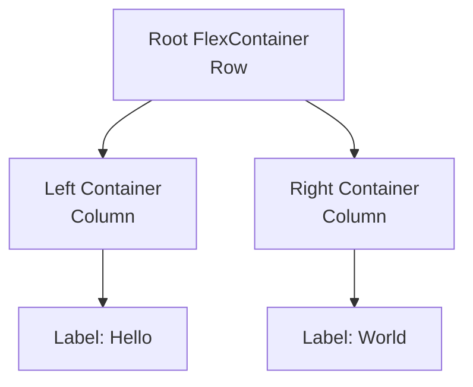
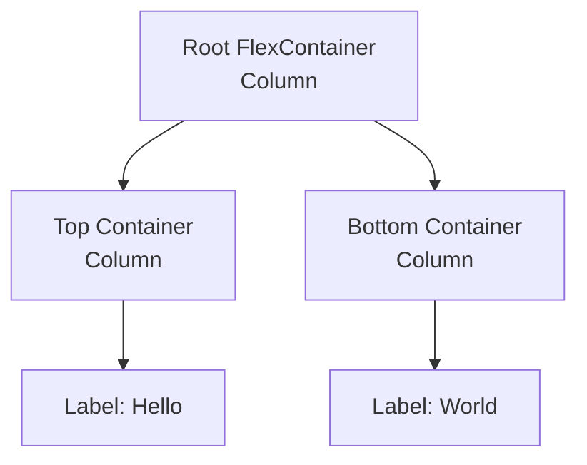
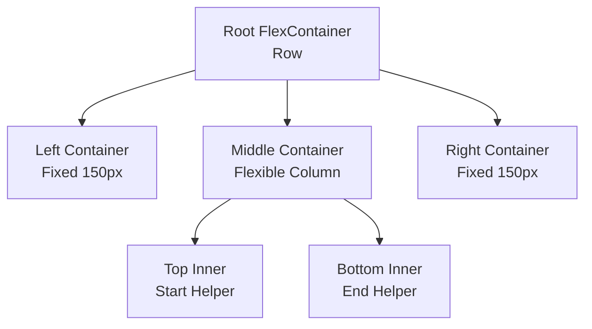
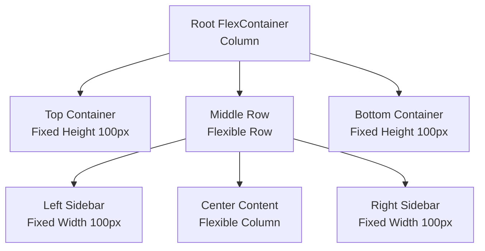
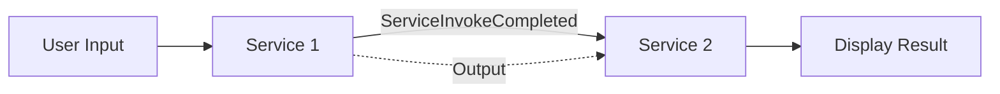
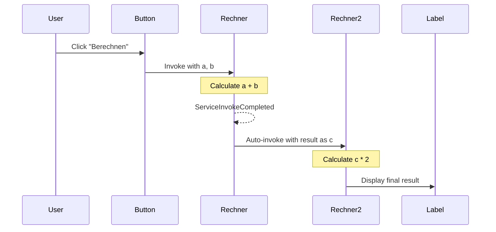

# Mashup Creation Recipes

This document collects proven recipes for programmatically creating ThingWorx Mashups. These recipes are designed to be used by agents or developers to quickly generate correct Mashup structures.

## Recipe 1: Two-Column Responsive Layout

This recipe creates a responsive Mashup with two side-by-side columns, each containing a centered label.

### Purpose
*   Demonstrates correct nesting of `flexcontainer` widgets.
*   Shows how to use `flex-direction: row` vs `column`.
*   Uses modern `ptcslabel` widgets.

### Structure


### Key JSON Properties

#### 1. Root Container
The root container holds the two columns. It uses `row` direction to place them side-by-side.
```javascript
{
    "Properties": {
        "Type": "flexcontainer",
        "flex-direction": "row", // Horizontal layout
        "align-items": "center",
        "justify-content": "space-around", // Space out columns
        "flex-grow": 1,
        "ResponsiveLayout": true
    },
    "Widgets": [ ... ]
}
```

#### 2. Child Containers (Columns)
Each child container holds content (ex. a label). It uses `column` direction (default vertical stacking) and centers its content.
```javascript
{
    "Properties": {
        "Type": "flexcontainer",
        "flex-direction": "column",
        "align-items": "center",
        "justify-content": "center", // Center content vertically
        "flex-grow": 1, // fill available space
        "ResponsiveLayout": true
    },
    "Widgets": [ ... ]
}
```

### Full Creation Script Template

Use this script as a template to create this layout. Remember to update `MASHUP_NAME`.

```javascript
const fs = require('fs');
const path = require('path');

// Load config
const envPath = path.join(__dirname, '.env.example');
const envContent = fs.readFileSync(envPath, 'utf8');
const config = {};
envContent.split('\n').forEach(line => {
    const [key, value] = line.split('=');
    if (key && value) config[key.trim()] = value.trim();
});

const BASE_URL = config.THINGWORX_BASE_URL;
const APP_KEY = config.THINGWORX_APP_KEY;
const MASHUP_NAME = "antigravity.hello-world-mu"; // CHANGE THIS NAME

async function createMashup() {
    console.log(`Creating Mashup: ${MASHUP_NAME}...`);

    const mashupContent = {
        "UI": {
            "Properties": {
                "Id": "mashup-root",
                "Type": "mashup",
                "ResponsiveLayout": true,
                "Width": 1024,
                "Height": 618,
                "Style": "DefaultMashupStyle",
                "StyleTheme": "PTC Convergence Theme",
                "Title": "Hello World Mashup",
                "Area": "Mashup",
                "__TypeDisplayName": "Mashup",
                "Visible": true,
                "Z-index": 10,
                "Top": 0,
                "Left": 0
            },
            "Widgets": [
                {
                    "Properties": {
                        "Type": "flexcontainer",
                        "__TypeDisplayName": "Responsive Container",
                        "Id": "flexcontainer-root",
                        "DisplayName": "root-container",
                        "flex-direction": "row",
                        "align-items": "center",
                        "justify-content": "space-around",
                        "flex-grow": 1,
                        "ResponsiveLayout": true,
                        "LastContainer": true
                    },
                    "Widgets": [
                        // Container 1 (Left)
                        {
                            "Properties": {
                                "Type": "flexcontainer",
                                "__TypeDisplayName": "Responsive Container",
                                "Id": "flexcontainer-1",
                                "DisplayName": "container-hello",
                                "flex-direction": "column",
                                "align-items": "center",
                                "justify-content": "center",
                                "flex-grow": 1,
                                "ResponsiveLayout": true
                            },
                            "Widgets": [
                                {
                                    "Properties": {
                                        "Type": "ptcslabel",
                                        "__TypeDisplayName": "Label",
                                        "Id": "ptcslabel-hello",
                                        "DisplayName": "lblHello",
                                        "LabelText": "Hello",
                                        "HorizontalAlignment": "left",
                                        "VerticalAlignment": "flex-start",
                                        "UseTheme": true,
                                        "Visible": true
                                    },
                                    "Widgets": []
                                }
                            ]
                        },
                        // Container 2 (Right)
                        {
                            "Properties": {
                                "Type": "flexcontainer",
                                "__TypeDisplayName": "Responsive Container",
                                "Id": "flexcontainer-2",
                                "DisplayName": "container-world",
                                "flex-direction": "column",
                                "align-items": "center",
                                "justify-content": "center",
                                "flex-grow": 1,
                                "ResponsiveLayout": true
                            },
                            "Widgets": [
                                {
                                    "Properties": {
                                        "Type": "ptcslabel",
                                        "__TypeDisplayName": "Label",
                                        "Id": "ptcslabel-world",
                                        "DisplayName": "lblWorld",
                                        "LabelText": "World",
                                        "HorizontalAlignment": "left",
                                        "VerticalAlignment": "flex-start",
                                        "UseTheme": true,
                                        "Visible": true
                                    },
                                    "Widgets": []
                                }
                            ]
                        }
                    ]
                }
            ]
        },
        "Data": {
            "Session": {
                "DataName": "Session",
                "EntityName": "",
                "EntityType": "Session",
                "Id": "session",
                "Services": [{
                    "Id": "SessionInterface",
                    "Name": "GetGlobalSessionValues",
                    "Characteristic": "Services",
                    "Target": "GetGlobalSessionValues",
                    "APIMethod": "post",
                    "RefreshInterval": 0,
                    "Parameters": {}
                }]
            },
            "UserExtensions": {
                "DataName": "UserExtensions",
                "EntityName": "",
                "EntityType": "UserExtensions",
                "Id": "UserExtensions",
                "Services": [{
                    "Id": "UserExtensionInterface",
                    "Name": "GetCurrentUserExtensionProperties",
                    "Characteristic": "Services",
                    "Target": "GetCurrentUserExtensionProperties",
                    "APIMethod": "post",
                    "RefreshInterval": 0,
                    "Parameters": {}
                }]
            }
        },
        "Events": [],
        "DataBindings": [],
        "mashupType": "mashup"
    };

    // Construct Payload
    const payload = {
        "entityType": "Mashups",
        "name": MASHUP_NAME,
        "description": "Recipe Created Mashup",
        "configurationTables": {
            "MobileSettings": {
                "name": "MobileSettings",
                "isHidden": true,
                "dataShape": {
                     "fieldDefinitions": {
                        "initialScale": { "baseType": "NUMBER", "name": "initialScale", "aspects": { "defaultValue": 1 } },
                        "width": { "baseType": "STRING", "name": "width", "aspects": { "defaultValue": "device-width" } },
                        "height": { "baseType": "STRING", "name": "height", "aspects": { "defaultValue": "device-height" } },
                        "minimumScale": { "baseType": "NUMBER", "name": "minimumScale", "aspects": { "defaultValue": 0.1 } },
                        "maximumScale": { "baseType": "NUMBER", "name": "maximumScale", "aspects": { "defaultValue": 10 } },
                        "disableZoom": { "baseType": "BOOLEAN", "name": "disableZoom", "aspects": { "defaultValue": false } },
                        "fullScreenMode": { "baseType": "BOOLEAN", "name": "fullScreenMode", "aspects": { "defaultValue": true } },
                        "iosStatusBarAppearance": { "baseType": "STRING", "name": "iosStatusBarAppearance", "aspects": { "defaultValue": "default" } },
                        "iosShortcutIconTitle": { "baseType": "STRING", "name": "iosShortcutIconTitle", "aspects": { "defaultValue": "" } }
                    }
                },
                "rows": [{
                    "initialScale": 1,
                    "width": "device-width",
                    "height": "device-height",
                    "minimumScale": 0.1,
                    "maximumScale": 10,
                    "disableZoom": false,
                    "fullScreenMode": true,
                    "iosStatusBarAppearance": "black-translucent",
                    "iosShortcutIconTitle": ""
                }]
            }
        },
        "aspects": {
            "mashupType": "mashup",
            "isResponsive": true,
            "isFlex": true
        },
        "mashupContent": JSON.stringify(mashupContent),
        "projectName": "PTCDefaultProject"
    };

    // Send Request
    const url = `${BASE_URL}/Mashups?Content-Type=application%2Fjson&reason=created%20by%20Antigravity`;
    const response = await fetch(url, {
        method: 'PUT',
        headers: {
            'appKey': APP_KEY,
            'Content-Type': 'application/json',
            'Accept': 'application/json'
        },
        body: JSON.stringify(payload)
    });

    if (!response.ok) {
        const text = await response.text();
        console.error(`Failed to create mashup: ${response.status} ${response.statusText}`);
        console.error(text);
    } else {
        console.log(`✓ Mashup '${MASHUP_NAME}' created successfully!`);
        console.log(`  View it at: ${BASE_URL}/Mashups/${MASHUP_NAME}`);
    }
}

createMashup();
```

## Recipe 2: Vertical Stacked Layout

This recipe creates a responsive Mashup with two stacked containers (one above the other), each containing a centered label.

### Purpose
*   Demonstrates vertical stacking using `flex-direction: column` on the root.
*   Shows how to structure simple dashboard-like vertical sections.

### Structure


### Key JSON Properties

#### 1. Root Container
The root container uses `column` direction to stack children vertically.
```javascript
{
    "Properties": {
        "Type": "flexcontainer",
        "flex-direction": "column", // Vertical layout
        "align-items": "center",
        "justify-content": "center",
        "flex-grow": 1,
        "ResponsiveLayout": true
    },
    "Widgets": [ ... ]
}
```

### Full Creation Script Template

Use this script as a template to create this layout. Remember to update `MASHUP_NAME`.

```javascript
const fs = require('fs');
const path = require('path');

// Load config
const envPath = path.join(__dirname, '.env.example');
const envContent = fs.readFileSync(envPath, 'utf8');
const config = {};
envContent.split('\n').forEach(line => {
    const [key, value] = line.split('=');
    if (key && value) config[key.trim()] = value.trim();
});

const BASE_URL = config.THINGWORX_BASE_URL;
const APP_KEY = config.THINGWORX_APP_KEY;
const MASHUP_NAME = "antigravity.hello-world-vertical-mu"; // CHANGE THIS NAME

async function createMashup() {
    console.log(`Creating Mashup: ${MASHUP_NAME}...`);

    const mashupContent = {
        "UI": {
            "Properties": {
                "Id": "mashup-root",
                "Type": "mashup",
                "ResponsiveLayout": true,
                "Width": 1024,
                "Height": 618,
                "Style": "DefaultMashupStyle",
                "StyleTheme": "PTC Convergence Theme",
                "Title": "Hello World Vertical Mashup",
                "Area": "Mashup",
                "__TypeDisplayName": "Mashup",
                "Visible": true,
                "Z-index": 10,
                "Top": 0,
                "Left": 0
            },
            "Widgets": [
                {
                    "Properties": {
                        "Type": "flexcontainer",
                        "__TypeDisplayName": "Responsive Container",
                        "Id": "flexcontainer-root",
                        "DisplayName": "root-container",
                        "flex-direction": "column", // Vertical Stacking
                        "align-items": "center",
                        "justify-content": "center",
                        "flex-grow": 1,
                        "ResponsiveLayout": true,
                        "LastContainer": true
                    },
                    "Widgets": [
                        // Container 1 (Top)
                        {
                            "Properties": {
                                "Type": "flexcontainer",
                                "__TypeDisplayName": "Responsive Container",
                                "Id": "flexcontainer-top",
                                "DisplayName": "container-hello",
                                "flex-direction": "column",
                                "align-items": "center",
                                "justify-content": "center",
                                "flex-grow": 1,
                                "ResponsiveLayout": true
                            },
                            "Widgets": [
                                {
                                    "Properties": {
                                        "Type": "ptcslabel",
                                        "__TypeDisplayName": "Label",
                                        "Id": "ptcslabel-hello",
                                        "DisplayName": "lblHello",
                                        "LabelText": "Hello",
                                        "HorizontalAlignment": "left",
                                        "VerticalAlignment": "flex-start",
                                        "UseTheme": true,
                                        "Visible": true
                                    },
                                    "Widgets": []
                                }
                            ]
                        },
                        // Container 2 (Bottom)
                        {
                            "Properties": {
                                "Type": "flexcontainer",
                                "__TypeDisplayName": "Responsive Container",
                                "Id": "flexcontainer-bottom",
                                "DisplayName": "container-world",
                                "flex-direction": "column",
                                "align-items": "center",
                                "justify-content": "center",
                                "flex-grow": 1,
                                "ResponsiveLayout": true
                            },
                            "Widgets": [
                                {
                                    "Properties": {
                                        "Type": "ptcslabel",
                                        "__TypeDisplayName": "Label",
                                        "Id": "ptcslabel-world",
                                        "DisplayName": "lblWorld",
                                        "LabelText": "World",
                                        "HorizontalAlignment": "left",
                                        "VerticalAlignment": "flex-start",
                                        "UseTheme": true,
                                        "Visible": true
                                    },
                                    "Widgets": []
                                }
                            ]
                        }
                    ]
                }
            ]
        },
        "Data": {
            "Session": {
                "DataName": "Session",
                "EntityName": "",
                "EntityType": "Session",
                "Id": "session",
                "Services": [{
                    "Id": "SessionInterface",
                    "Name": "GetGlobalSessionValues",
                    "Characteristic": "Services",
                    "Target": "GetGlobalSessionValues",
                    "APIMethod": "post",
                    "RefreshInterval": 0,
                    "Parameters": {}
                }]
            },
            "UserExtensions": {
                "DataName": "UserExtensions",
                "EntityName": "",
                "EntityType": "UserExtensions",
                "Id": "UserExtensions",
                "Services": [{
                    "Id": "UserExtensionInterface",
                    "Name": "GetCurrentUserExtensionProperties",
                    "Characteristic": "Services",
                    "Target": "GetCurrentUserExtensionProperties",
                    "APIMethod": "post",
                    "RefreshInterval": 0,
                    "Parameters": {}
                }]
            }
        },
        "Events": [],
        "DataBindings": [],
        "mashupType": "mashup"
    };

    const payload = {
        "entityType": "Mashups",
        "name": MASHUP_NAME,
        "description": "Hello World Vertical Mashup",
        "configurationTables": {
            "MobileSettings": {
                "name": "MobileSettings",
                "isHidden": true,
                "dataShape": {
                     "fieldDefinitions": {
                        "initialScale": { "baseType": "NUMBER", "name": "initialScale", "aspects": { "defaultValue": 1 } },
                        "width": { "baseType": "STRING", "name": "width", "aspects": { "defaultValue": "device-width" } },
                        "height": { "baseType": "STRING", "name": "height", "aspects": { "defaultValue": "device-height" } },
                        "minimumScale": { "baseType": "NUMBER", "name": "minimumScale", "aspects": { "defaultValue": 0.1 } },
                        "maximumScale": { "baseType": "NUMBER", "name": "maximumScale", "aspects": { "defaultValue": 10 } },
                        "disableZoom": { "baseType": "BOOLEAN", "name": "disableZoom", "aspects": { "defaultValue": false } },
                        "fullScreenMode": { "baseType": "BOOLEAN", "name": "fullScreenMode", "aspects": { "defaultValue": true } },
                        "iosStatusBarAppearance": { "baseType": "STRING", "name": "iosStatusBarAppearance", "aspects": { "defaultValue": "default" } },
                        "iosShortcutIconTitle": { "baseType": "STRING", "name": "iosShortcutIconTitle", "aspects": { "defaultValue": "" } }
                    }
                },
                "rows": [{
                    "initialScale": 1,
                    "width": "device-width",
                    "height": "device-height",
                    "minimumScale": 0.1,
                    "maximumScale": 10,
                    "disableZoom": false,
                    "fullScreenMode": true,
                    "iosStatusBarAppearance": "black-translucent",
                    "iosShortcutIconTitle": ""
                }]
            }
        },
        "aspects": {
            "mashupType": "mashup",
            "isResponsive": true,
            "isFlex": true
        },
        "mashupContent": JSON.stringify(mashupContent),
        "projectName": "PTCDefaultProject"
    };

    const url = `${BASE_URL}/Mashups?Content-Type=application%2Fjson&reason=created%20by%20Antigravity`;

    const response = await fetch(url, {
        method: 'PUT',
        headers: {
            'appKey': APP_KEY,
            'Content-Type': 'application/json',
            'Accept': 'application/json'
        },
        body: JSON.stringify(payload)
    });

    if (!response.ok) {
        const text = await response.text();
        console.error(`Failed to create mashup: ${response.status} ${response.statusText}`);
        console.error(text);
    } else {
        console.log(`✓ Mashup '${MASHUP_NAME}' created successfully!`);
        console.log(`  View it at: ${BASE_URL}/Mashups/${MASHUP_NAME}`);
    }
}

createMashup();
```

## Recipe 3: Complex Fixed Sidebar Layout

This recipe demonstrates a more advanced layout commonly used for applications: A main workspace flanked by fixed-width static sidebars (e.g., for navigation or tool panels).

### Purpose
*   **Mixing Static & Responsive**: Shows how to keep sidebars fixed while the center content grows.
*   **Strict Flex Sizing**: Demonstrates the use of explicit `flex-min-width` and `flex-max-width` to force containers to adhere to specific pixel dimensions.
*   **Empty Static Containers**: Shows configuration for structural containers that may be populated dynamically at runtime or used for spacing.

### Structure


### Key JSON Properties

#### 1. Fixed Sidebar Containers
To force a container to be exactly 150px wide and **never** resize, you must use a combination of standard properties and strict flex properties.

**Critical Properties**:
*   `ResponsiveLayout`: `false` (Treats internal layout as static canvas, good for fixed tools).
*   `flex-grow`: `0` (Do not grow).
*   `flex-shrink`: `0` (Do not shrink).
*   `flex-basis`: `"150px"` (Initial size).
*   `flex-min-width`: `"150px"` (Hard floor).
*   `flex-max-width`: `"150px"` (Hard ceiling).

```javascript
{
    "Properties": {
        "Type": "flexcontainer",
        "Id": "flexcontainer-left",
        "DisplayName": "FixedSidebar",
        "ResponsiveLayout": false, // Static internal
        "Width": 150,
        "MinWidth": 150,
        "MaxWidth": 150,
        // STRICT FLEX LOCKING
        "flex-grow": 0,
        "flex-shrink": 0,
        "flex-basis": "150px",
        "flex-min-width": "150px",
        "flex-max-width": "150px"
    },
    "Widgets": []
}
```

### Full Creation Script Template

Use this script to generate the complex layout.

```javascript
const fs = require('fs');
const path = require('path');

// Load config
const envPath = path.join(__dirname, '.env.example');
const envContent = fs.readFileSync(envPath, 'utf8');
const config = {};
envContent.split('\n').forEach(line => {
    const [key, value] = line.split('=');
    if (key && value) config[key.trim()] = value.trim();
});

const BASE_URL = config.THINGWORX_BASE_URL;
const APP_KEY = config.THINGWORX_APP_KEY;
const MASHUP_NAME = "antigravity.complex-layout-mu"; // CHANGE THIS NAME

async function createMashup() {
    console.log(`Creating Mashup: ${MASHUP_NAME}...`);

    const mashupContent = {
        "UI": {
            "Properties": {
                "Id": "mashup-root",
                "Type": "mashup",
                "ResponsiveLayout": true,
                "Width": 1024,
                "Height": 618,
                "Style": "DefaultMashupStyle",
                "StyleTheme": "PTC Convergence Theme",
                "Title": "Complex Layout Mashup",
                "Area": "Mashup",
                "__TypeDisplayName": "Mashup",
                "Visible": true,
                "Z-index": 10,
                "Top": 0,
                "Left": 0
            },
            "Widgets": [
                {
                    "Properties": {
                        "Type": "flexcontainer",
                        "__TypeDisplayName": "Responsive Container",
                        "Id": "flexcontainer-root",
                        "DisplayName": "root-row",
                        "flex-direction": "row", // Horizontal main layout
                        "align-items": "stretch",
                        "justify-content": "flex-start",
                        "flex-grow": 1,
                        "ResponsiveLayout": true,
                        "LastContainer": true
                    },
                    "Widgets": [
                        // 1. LEFT CONTAINER (Fixed 150px, Static)
                        {
                            "Properties": {
                                "Type": "flexcontainer",
                                "__TypeDisplayName": "Responsive Container",
                                "Id": "flexcontainer-left",
                                "DisplayName": "container-left-fixed",
                                // "Static" internal behavior
                                "ResponsiveLayout": false,
                                "Width": 150,
                                "MinWidth": 150,
                                "MaxWidth": 150,
                                // Strict Flex Fixed sizing
                                "flex-grow": 0,
                                "flex-shrink": 0,
                                "flex-basis": "150px",
                                "flex-min-width": "150px",
                                "flex-max-width": "150px",
                                "Style": "DefaultContainerStyle"
                            },
                            "Widgets": [] // Empty as requested
                        },
                        // 2. MIDDLE CONTAINER (Flexible, Vertical Stack)
                        {
                            "Properties": {
                                "Type": "flexcontainer",
                                "__TypeDisplayName": "Responsive Container",
                                "Id": "flexcontainer-middle",
                                "DisplayName": "container-middle-flex",
                                "flex-direction": "column", // Vertical stack inside
                                "align-items": "stretch",
                                "justify-content": "flex-start",
                                "flex-grow": 1, // Take remaining space
                                "ResponsiveLayout": true
                            },
                            "Widgets": [
                                // Top Inner (Hello)
                                {
                                    "Properties": {
                                        "Type": "flexcontainer",
                                        "Id": "flexcontainer-mid-top",
                                        "DisplayName": "container-hello",
                                        "flex-direction": "column",
                                        "align-items": "center",
                                        "justify-content": "center",
                                        "flex-grow": 1,
                                        "ResponsiveLayout": true
                                    },
                                    "Widgets": [
                                        {
                                            "Properties": {
                                                "Type": "ptcslabel",
                                                "Id": "ptcslabel-hello",
                                                "LabelText": "Hello",
                                                "Visible": true
                                            },
                                            "Widgets": []
                                        }
                                    ]
                                },
                                // Bottom Inner (World)
                                {
                                    "Properties": {
                                        "Type": "flexcontainer",
                                        "Id": "flexcontainer-mid-bottom",
                                        "DisplayName": "container-world",
                                        "flex-direction": "column",
                                        "align-items": "center",
                                        "justify-content": "center",
                                        "flex-grow": 1,
                                        "ResponsiveLayout": true
                                    },
                                    "Widgets": [
                                        {
                                            "Properties": {
                                                "Type": "ptcslabel",
                                                "Id": "ptcslabel-world",
                                                "LabelText": "World",
                                                "Visible": true
                                            },
                                            "Widgets": []
                                        }
                                    ]
                                }
                            ]
                        },
                        // 3. RIGHT CONTAINER (Fixed 150px, Static)
                        {
                            "Properties": {
                                "Type": "flexcontainer",
                                "__TypeDisplayName": "Responsive Container",
                                "Id": "flexcontainer-right",
                                "DisplayName": "container-right-fixed",
                                // "Static" internal behavior
                                "ResponsiveLayout": false,
                                "Width": 150,
                                "MinWidth": 150,
                                "MaxWidth": 150,
                                // Strict Flex Fixed sizing
                                "flex-grow": 0,
                                "flex-shrink": 0,
                                "flex-basis": "150px",
                                "flex-min-width": "150px",
                                "flex-max-width": "150px",
                                "Style": "DefaultContainerStyle"
                            },
                            "Widgets": [] // Empty as requested
                        }
                    ]
                }
            ]
        },
        "Data": {
            "Session": {
                "DataName": "Session",
                "EntityName": "",
                "EntityType": "Session",
                "Id": "session",
                "Services": [{
                    "Id": "SessionInterface",
                    "Name": "GetGlobalSessionValues",
                    "Characteristic": "Services",
                    "Target": "GetGlobalSessionValues",
                    "APIMethod": "post",
                    "RefreshInterval": 0,
                    "Parameters": {}
                }]
            },
            "UserExtensions": {
                "DataName": "UserExtensions",
                "EntityName": "",
                "EntityType": "UserExtensions",
                "Id": "UserExtensions",
                "Services": [{
                    "Id": "UserExtensionInterface",
                    "Name": "GetCurrentUserExtensionProperties",
                    "Characteristic": "Services",
                    "Target": "GetCurrentUserExtensionProperties",
                    "APIMethod": "post",
                    "RefreshInterval": 0,
                    "Parameters": {}
                }]
            }
        },
        "Events": [],
        "DataBindings": [],
        "mashupType": "mashup"
    };

    // DELETE existing mashup first to avoid 409
    try {
        console.log(`Deleting existing Mashup (if any): ${MASHUP_NAME}...`);
        await fetch(`${BASE_URL}/Mashups/${MASHUP_NAME}`, {
            method: 'DELETE',
            headers: {
                'appKey': APP_KEY,
                'Content-Type': 'application/json',
                'Accept': 'application/json'
            }
        });
    } catch (e) {
        // Ignore delete errors
    }

    const payload = {
        "entityType": "Mashups",
        "name": MASHUP_NAME,
        "description": "Complex Layout Mashup (Left/Right Fixed Static 150px, Center Split)",
        "configurationTables": {
            "MobileSettings": {
                "name": "MobileSettings",
                "isHidden": true,
                "dataShape": {
                     "fieldDefinitions": {
                        "initialScale": { "baseType": "NUMBER", "name": "initialScale", "aspects": { "defaultValue": 1 } },
                        "width": { "baseType": "STRING", "name": "width", "aspects": { "defaultValue": "device-width" } },
                        "height": { "baseType": "STRING", "name": "height", "aspects": { "defaultValue": "device-height" } },
                        "minimumScale": { "baseType": "NUMBER", "name": "minimumScale", "aspects": { "defaultValue": 0.1 } },
                        "maximumScale": { "baseType": "NUMBER", "name": "maximumScale", "aspects": { "defaultValue": 10 } },
                        "disableZoom": { "baseType": "BOOLEAN", "name": "disableZoom", "aspects": { "defaultValue": false } },
                        "fullScreenMode": { "baseType": "BOOLEAN", "name": "fullScreenMode", "aspects": { "defaultValue": true } },
                        "iosStatusBarAppearance": { "baseType": "STRING", "name": "iosStatusBarAppearance", "aspects": { "defaultValue": "default" } },
                        "iosShortcutIconTitle": { "baseType": "STRING", "name": "iosShortcutIconTitle", "aspects": { "defaultValue": "" } }
                    }
                },
                "rows": [{
                    "initialScale": 1,
                    "width": "device-width",
                    "height": "device-height",
                    "minimumScale": 0.1,
                    "maximumScale": 10,
                    "disableZoom": false,
                    "fullScreenMode": true,
                    "iosStatusBarAppearance": "black-translucent",
                    "iosShortcutIconTitle": ""
                }]
            }
        },
        "aspects": {
            "mashupType": "mashup",
            "isResponsive": true,
            "isFlex": true
        },
        "mashupContent": JSON.stringify(mashupContent),
        "projectName": "PTCDefaultProject"
    };

    const url = `${BASE_URL}/Mashups?Content-Type=application%2Fjson&reason=created%20by%20Antigravity`;

    const response = await fetch(url, {
        method: 'PUT',
        headers: {
            'appKey': APP_KEY,
            'Content-Type': 'application/json',
            'Accept': 'application/json'
        },
        body: JSON.stringify(payload)
    });

    if (!response.ok) {
        const text = await response.text();
        console.error(`Failed to create mashup: ${response.status} ${response.statusText}`);
        console.error(text);
    } else {
        console.log(`✓ Mashup '${MASHUP_NAME}' created successfully!`);
        console.log(`  View it at: ${BASE_URL}/Mashups/${MASHUP_NAME}`);
    }
}

createMashup();
```

## Recipe 4: Border Layout (Holy Grail)

This recipe implements a classic "Holy Grail" or "Border Layout": Header, Footer, Left Sidebar, Right Sidebar, and a flexible Center content area.

### Purpose
*   **Full Application Layout**: Typical dashboard structure.
*   **Nested Flex Stacks**: Uses a vertical stack for the main structure (Header / Middle / Footer) and a horizontal stack for the middle section (Left / Center / Right).
*   **Fixed Dimension Containers**: Demonstrates locking height for headers/footers and width for sidebars.

### Structure


### Key JSON Properties

#### 1. Header/Footer (Fixed Height)
To fix vertical height, use `MinHeight`, `MaxHeight`, and matching flex properties.
```javascript
{
    "Properties": {
        "Type": "flexcontainer",
        "ResponsiveLayout": false,
        "Height": 100,
        "MinHeight": 100,
        "MaxHeight": 100,
        "flex-grow": 0,
        "flex-shrink": 0,
        "flex-basis": "100px",
        "flex-min-height": "100px",
        "flex-max-height": "100px"
    },
    "Widgets": []
}
```

#### 2. Sidebars (Fixed Width)
Same concept but using Width properties.
```javascript
{
    "Properties": {
        "Type": "flexcontainer",
        "ResponsiveLayout": false,
        "Width": 100,
        "MinWidth": 100,
        "MaxWidth": 100,
        "flex-grow": 0,
        "flex-shrink": 0,
        "flex-basis": "100px",
        "flex-min-width": "100px",
        "flex-max-width": "100px"
    },
    "Widgets": []
}
```


## Recipe 5: Using a Master Mashup

You can assign a **Master Mashup** to your new Mashup to inherit common header, footer, or navigation elements.

### Usage
To specify a Master Mashup, add the `"Master"` property to the root `UI` -> `Properties` object in your JSON definition.

### JSON Snippet
```javascript
"UI": {
    "Properties": {
        "Id": "mashup-root",
        "Type": "mashup",
        "ResponsiveLayout": true,
        "Title": "My Mashup with Master",
        // ... other properties ...
        "Master": "antigravity.Master-mm" // Add this line!
    },
    "Widgets": [ ... ]
}
```

### Important Notes
*   **Name Validation**: Ensure the Master Mashup name (`antigravity.Master-mm` in the example) exists on the server *before* you create your child mashup, otherwise creation might fail or the mashup will be broken.
*   **Layout Inheritance**: Your mashup's content will be injected into the `Content` placeholder of the Master Mashup.

## Recipe 6: Integrating Thing Services into Mashups

This recipe demonstrates how to add services from external Things to your Mashup, making them available for data binding, event handling, and service invocation.

### Purpose
*   **External Service Integration**: Shows how to register services from Things in the Mashup's Data section.
*   **Service Configuration**: Explains the structure and properties needed to properly configure Thing services.
*   **Real-World Example**: Uses the `ServiceHelper` Thing with its `Rechner` service as a practical example.

### When to Use
Use this pattern when you need to:
*   Call services from Things in response to user actions (e.g., button clicks)
*   Bind Thing service results to UI widgets (e.g., display calculation results)
*   Access Thing properties or methods from within the Mashup
*   Create interactive dashboards that communicate with backend Things

### Data Section Structure

The `Data` section of a Mashup contains all external data sources. By default, every Mashup includes `Session` and `UserExtensions`. To add Thing services, you add a new entry for each Thing.

#### Basic Structure
```javascript
"Data": {
    "Session": { ... },           // Always present
    "UserExtensions": { ... },    // Always present
    "YourThingName": {            // Add your Thing here
        "DataName": "YourThingName",
        "EntityName": "YourThingName",
        "EntityType": "Things",   // Critical: Must be "Things" for Thing entities
        "Id": "YourThingName",
        "Services": [ ... ]       // Array of services to register
    }
}
```

### Adding a Thing as a Data Source

To add a Thing to your Mashup, you need to specify:

| Property | Description | Example |
|----------|-------------|---------|
| `DataName` | Display name for the data source | `"ServiceHelper"` |
| `EntityName` | Exact name of the Thing on the server | `"ServiceHelper"` |
| `EntityType` | Type of entity - **must be `"Things"`** | `"Things"` |
| `Id` | Unique identifier within the Mashup | `"ServiceHelper"` |
| `Services` | Array of service definitions | `[{ ... }]` |

> [!IMPORTANT]
> The `EntityType` must be exactly `"Things"` (case-sensitive) for Thing entities. Other entity types include `"Session"`, `"UserExtensions"`, `"Resources"`, etc.

### Registering Services

Each service in the `Services` array must be configured with the following properties:

```javascript
{
    "Id": "UniqueServiceId",        // Unique ID for this service instance
    "Name": "ServiceName",          // Exact name of the service on the Thing
    "Characteristic": "Services",   // Always "Services" for service calls
    "Target": "ServiceName",        // Same as Name - the service to invoke
    "APIMethod": "post",            // HTTP method - always "post" for services
    "RefreshInterval": 0,           // Auto-refresh interval in ms (0 = manual only)
    "Parameters": {}                // Service parameters (if any)
}
```

#### Service Properties Explained

*   **Id**: A unique identifier for this service within the Mashup. Can be descriptive (e.g., `"RechnerService"`) or match the service name.
*   **Name**: The exact name of the service as defined on the Thing. **Case-sensitive**.
*   **Characteristic**: Always set to `"Services"` when registering a service.
*   **Target**: The service method to call. Typically the same as `Name`.
*   **APIMethod**: Always `"post"` for service invocations.
*   **RefreshInterval**: How often to auto-refresh the service (in milliseconds). Set to `0` for manual invocation only.
*   **Parameters**: An object containing default parameter values. Can be empty `{}` if parameters will be bound dynamically.

### Complete Example: ServiceHelper with Rechner Service

This example shows how to add the `Rechner` service from the `ServiceHelper` Thing.

```javascript
const mashupContent = {
    "UI": {
        "Properties": {
            "Id": "mashup-root",
            "Type": "mashup",
            "ResponsiveLayout": true,
            "Width": 1024,
            "Height": 618,
            "Style": "DefaultMashupStyle",
            "StyleTheme": "PTC Convergence Theme",
            "Title": "Service Helper Mashup",
            "Area": "Mashup",
            "__TypeDisplayName": "Mashup",
            "Visible": true,
            "Z-index": 10,
            "Top": 0,
            "Left": 0
        },
        "Widgets": [
            {
                "Properties": {
                    "Type": "flexcontainer",
                    "__TypeDisplayName": "Responsive Container",
                    "Id": "flexcontainer-root",
                    "DisplayName": "root-container",
                    "flex-direction": "column",
                    "align-items": "center",
                    "justify-content": "center",
                    "flex-grow": 1,
                    "ResponsiveLayout": true,
                    "LastContainer": true
                },
                "Widgets": []
            }
        ]
    },
    "Data": {
        "Session": {
            "DataName": "Session",
            "EntityName": "",
            "EntityType": "Session",
            "Id": "session",
            "Services": [{
                "Id": "SessionInterface",
                "Name": "GetGlobalSessionValues",
                "Characteristic": "Services",
                "Target": "GetGlobalSessionValues",
                "APIMethod": "post",
                "RefreshInterval": 0,
                "Parameters": {}
            }]
        },
        "UserExtensions": {
            "DataName": "UserExtensions",
            "EntityName": "",
            "EntityType": "UserExtensions",
            "Id": "UserExtensions",
            "Services": [{
                "Id": "UserExtensionInterface",
                "Name": "GetCurrentUserExtensionProperties",
                "Characteristic": "Services",
                "Target": "GetCurrentUserExtensionProperties",
                "APIMethod": "post",
                "RefreshInterval": 0,
                "Parameters": {}
            }]
        },
        // ===== ADD YOUR THING HERE =====
        "ServiceHelper": {
            "DataName": "ServiceHelper",
            "EntityName": "ServiceHelper",      // Exact Thing name on server
            "EntityType": "Things",             // Must be "Things"
            "Id": "ServiceHelper",
            "Services": [{
                "Id": "RechnerService",         // Unique ID for this service
                "Name": "Rechner",              // Exact service name (case-sensitive)
                "Characteristic": "Services",
                "Target": "Rechner",
                "APIMethod": "post",
                "RefreshInterval": 0,
                "Parameters": {}                // Add parameters if needed
            }]
        }
    },
    "Events": [],
    "DataBindings": [],
    "mashupType": "mashup"
};
```

### Adding Multiple Services from the Same Thing

You can register multiple services from the same Thing by adding more entries to the `Services` array:

```javascript
"ServiceHelper": {
    "DataName": "ServiceHelper",
    "EntityName": "ServiceHelper",
    "EntityType": "Things",
    "Id": "ServiceHelper",
    "Services": [
        {
            "Id": "RechnerService",
            "Name": "Rechner",
            "Characteristic": "Services",
            "Target": "Rechner",
            "APIMethod": "post",
            "RefreshInterval": 0,
            "Parameters": {}
        },
        {
            "Id": "AnotherService",
            "Name": "AnotherServiceName",
            "Characteristic": "Services",
            "Target": "AnotherServiceName",
            "APIMethod": "post",
            "RefreshInterval": 0,
            "Parameters": {}
        }
    ]
}
```

### Adding Multiple Things

To add services from multiple Things, add separate entries in the `Data` section:

```javascript
"Data": {
    "Session": { ... },
    "UserExtensions": { ... },
    "ServiceHelper": {
        "DataName": "ServiceHelper",
        "EntityName": "ServiceHelper",
        "EntityType": "Things",
        "Id": "ServiceHelper",
        "Services": [ ... ]
    },
    "AnotherThing": {
        "DataName": "AnotherThing",
        "EntityName": "AnotherThing",
        "EntityType": "Things",
        "Id": "AnotherThing",
        "Services": [ ... ]
    }
}
```

### Service Parameters

If your service requires parameters, you can specify default values in the `Parameters` object:

```javascript
{
    "Id": "CalculateService",
    "Name": "Calculate",
    "Characteristic": "Services",
    "Target": "Calculate",
    "APIMethod": "post",
    "RefreshInterval": 0,
    "Parameters": {
        "input1": 10,
        "input2": 20,
        "operation": "add"
    }
}
```

> [!NOTE]
> Parameters can also be bound dynamically from UI widgets using Data Bindings. The values in the `Parameters` object serve as defaults.

### Using the Service in the Mashup

Once registered, the service can be:
1. **Invoked by Events**: Bind a button's `Clicked` event to the service
2. **Bound to Widgets**: Bind service output to labels, grids, or other display widgets
3. **Chained with Other Services**: Use the output of one service as input to another

These bindings are configured in the `Events` and `DataBindings` sections of the Mashup JSON.

### Common Pitfalls

> [!WARNING]
> **Case Sensitivity**: Thing names and service names are case-sensitive. `"ServiceHelper"` is different from `"servicehelper"`.

> [!WARNING]
> **EntityType**: Always use `"Things"` (capital T) for Thing entities. Using `"Thing"` or `"things"` will fail.

> [!CAUTION]
> **Thing Existence**: Ensure the Thing exists on the server before creating the Mashup. If the Thing doesn't exist, the Mashup will be created but the service will not be available.

### Full Script Example

See [create_service_helper_mashup.js](file:///c:/Users/tk/IdeaProjects/CodeingAgentThingWorxDevelopmentEnvironment/create_service_helper_mashup.js) for a complete working example that creates a Mashup with the ServiceHelper Thing and Rechner service.

## Recipe 7: Interactive Mashups with Service Bindings and Events

This recipe demonstrates how to create fully interactive mashups that bind UI widgets to service parameters, invoke services on button clicks, and display service results. This is essential for creating functional applications.

### Purpose
*   **Complete Interactivity**: Shows how to create mashups where user actions trigger service calls
*   **Data Flow**: Demonstrates bidirectional data flow between UI and services
*   **Event Handling**: Explains how to bind button clicks to service invocations
*   **Real Example**: Uses a working calculator mashup as reference

### When to Use
Use this pattern when you need to:
*   Create forms that submit data to services
*   Build calculators or data processors
*   Implement search or filter functionality
*   Create any mashup where user input triggers backend processing

### Overview: The Three Key Components

1. **Service Integration** (Recipe 6): Add the Thing and its service to the Data section
2. **Data Bindings**: Connect UI widgets to service parameters and outputs
3. **Event Bindings**: Trigger service execution on user actions (e.g., button clicks)

### Event Binding Structure

Events bind user actions (like button clicks) to service invocations. The structure is different from DataBindings.

#### Event Binding Format

```javascript
"Events": [
    {
        "Id": "unique-event-id",
        "EventTriggerArea": "UI",              // Where the event originates
        "EventHandlerArea": "Data",            // Where the handler is (service)
        "EventTriggerSection": "",             // Empty for UI widgets
        "EventTriggerId": "button-widget-id",  // Widget that triggers the event
        "EventTriggerEvent": "Clicked",        // Event type (Clicked, Changed, etc.)
        "EventHandlerId": "ThingName",         // Thing name from Data section
        "EventHandlerService": "ServiceName"   // Service to invoke
    }
]
```

#### Key Properties

| Property | Description | Example |
|----------|-------------|---------|
| `EventTriggerArea` | Where event originates (`"UI"` or `"Data"`) | `"UI"` |
| `EventHandlerArea` | Where handler is located (`"Data"` or `"UI"`) | `"Data"` |
| `EventTriggerId` | ID of widget triggering event | `"ptcsbutton-calculate"` |
| `EventTriggerEvent` | Type of event | `"Clicked"`, `"Changed"`, `"SelectedRowsChanged"` |
| `EventHandlerId` | Thing name (matches Data section key) | `"ServiceHelper"` |
| `EventHandlerService` | Service name to invoke | `"Rechner"` |

> [!IMPORTANT]
> Event bindings use `EventTrigger*` and `EventHandler*` properties, **not** `Source*` and `Target*` like DataBindings.

### DataBinding Structure for Service Parameters

DataBindings connect UI widget values to service input parameters. This is how you pass user input to services.

#### Service Parameter Binding Format

```javascript
"DataBindings": [
    {
        "Id": "unique-binding-id",
        "SourceId": "widget-id",           // UI widget ID
        "SourceArea": "UI",
        "SourceSection": "",
        "SourceDetails": "",
        "TargetArea": "Data",
        "TargetSection": "ThingName",      // Thing name from Data section
        "TargetId": "ServiceName",         // Service name
        "PropertyMaps": [
            {
                "SourceProperty": "Value",              // Widget property
                "SourcePropertyType": "Property",
                "SourcePropertyBaseType": "NUMBER",     // Widget data type
                "TargetProperty": "parameterName",      // Service parameter name
                "TargetPropertyType": "Parameter",      // ⚠️ MUST be "Parameter"
                "TargetPropertyBaseType": "NUMBER"      // Service parameter type
            }
        ]
    }
]
```

#### Critical Properties for Service Parameters

| Property | Value | Why |
|----------|-------|-----|
| `TargetArea` | `"Data"` | Service is in Data section |
| `TargetSection` | Thing name | Matches key in Data section |
| `TargetId` | Service name | The service to bind to |
| `TargetPropertyType` | **`"Parameter"`** | ⚠️ Critical: Identifies service input parameter |
| `TargetPropertyBaseType` | Match service type | `"NUMBER"`, `"STRING"`, `"BOOLEAN"`, etc. |

> [!WARNING]
> **TargetPropertyType MUST be `"Parameter"`** for service input parameters. Using `"Property"` will not work.

### DataBinding Structure for Service Outputs

DataBindings also connect service results back to UI widgets for display.

#### Service Output Binding Format

```javascript
"DataBindings": [
    {
        "Id": "unique-binding-id",
        "SourceId": "ServiceName",         // Service name
        "SourceArea": "Data",
        "SourceSection": "ThingName",      // Thing name from Data section
        "SourceDetails": "AllData",        // ⚠️ MUST be "AllData" for service results
        "TargetArea": "UI",
        "TargetSection": "",
        "TargetId": "widget-id",           // UI widget ID
        "PropertyMaps": [
            {
                "SourceProperty": "resultFieldName",    // Service output field name
                "SourcePropertyType": "Field",          // ⚠️ MUST be "Field"
                "SourcePropertyBaseType": "NUMBER",     // Service output type
                "TargetProperty": "LabelText",          // Widget property
                "TargetPropertyType": "property",       // lowercase "property"
                "TargetPropertyBaseType": "STRING"      // Widget property type
            }
        ]
    }
]
```

#### Critical Properties for Service Outputs

| Property | Value | Why |
|----------|-------|-----|
| `SourceArea` | `"Data"` | Service is in Data section |
| `SourceSection` | Thing name | Matches key in Data section |
| `SourceId` | Service name | The service providing output |
| `SourceDetails` | **`"AllData"`** | ⚠️ Required for service results |
| `SourcePropertyType` | **`"Field"`** | ⚠️ Critical: Identifies service output field |

> [!WARNING]
> **SourcePropertyType MUST be `"Field"`** for service outputs. Using `"Property"` will not work.

> [!IMPORTANT]
> **SourceDetails MUST be `"AllData"`** for service output bindings.

### Complete Example: Calculator Mashup

This example shows a fully functional calculator that:
1. Takes two numeric inputs (Zahl A and Zahl B)
2. Invokes the ServiceHelper.Rechner service when button is clicked
3. Displays the result in a label

#### Data Section

```javascript
"Data": {
    "Session": { /* ... standard ... */ },
    "UserExtensions": { /* ... standard ... */ },
    "ServiceHelper": {
        "DataName": "ServiceHelper",
        "EntityName": "ServiceHelper",
        "EntityType": "Things",
        "Id": "ServiceHelper",
        "Services": [{
            "Id": "RechnerService",
            "Name": "Rechner",
            "Characteristic": "Services",
            "Target": "Rechner",
            "APIMethod": "post",
            "RefreshInterval": 0,
            "Parameters": {}
        }]
    }
}
```

#### UI Widgets

```javascript
"Widgets": [
    {
        "Properties": {
            "Type": "numericentry",
            "Id": "numericentry-a",
            "Label": "Zahl A:",
            "Value": 0
        }
    },
    {
        "Properties": {
            "Type": "numericentry",
            "Id": "numericentry-b",
            "Label": "Zahl B:",
            "Value": 0
        }
    },
    {
        "Properties": {
            "Type": "ptcsbutton",
            "Id": "ptcsbutton-calculate",
            "Label": "Berechnen"
        }
    },
    {
        "Properties": {
            "Type": "ptcslabel",
            "Id": "ptcslabel-result",
            "LabelText": "value ergebnis"
        }
    }
]
```

#### Events: Button Click → Service Invocation

```javascript
"Events": [
    {
        "Id": "event-button-invoke-rechner",
        "EventTriggerArea": "UI",
        "EventHandlerArea": "Data",
        "EventTriggerSection": "",
        "EventTriggerId": "ptcsbutton-calculate",
        "EventTriggerEvent": "Clicked",
        "EventHandlerId": "ServiceHelper",
        "EventHandlerService": "Rechner"
    }
]
```

#### DataBindings: Input A → Service Parameter a

```javascript
{
    "Id": "binding-input-a-to-service",
    "SourceId": "numericentry-a",
    "SourceArea": "UI",
    "SourceSection": "",
    "SourceDetails": "",
    "TargetArea": "Data",
    "TargetSection": "ServiceHelper",
    "TargetId": "Rechner",
    "PropertyMaps": [
        {
            "SourceProperty": "Value",
            "SourcePropertyType": "Property",
            "SourcePropertyBaseType": "NUMBER",
            "TargetProperty": "a",
            "TargetPropertyType": "Parameter",      // ⚠️ Parameter for service input
            "TargetPropertyBaseType": "NUMBER"
        }
    ]
}
```

#### DataBindings: Input B → Service Parameter b

```javascript
{
    "Id": "binding-input-b-to-service",
    "SourceId": "numericentry-b",
    "SourceArea": "UI",
    "SourceSection": "",
    "SourceDetails": "",
    "TargetArea": "Data",
    "TargetSection": "ServiceHelper",
    "TargetId": "Rechner",
    "PropertyMaps": [
        {
            "SourceProperty": "Value",
            "SourcePropertyType": "Property",
            "SourcePropertyBaseType": "NUMBER",
            "TargetProperty": "b",
            "TargetPropertyType": "Parameter",      // ⚠️ Parameter for service input
            "TargetPropertyBaseType": "NUMBER"
        }
    ]
}
```

#### DataBindings: Service Output → Label

```javascript
{
    "Id": "binding-service-result-to-label",
    "SourceId": "Rechner",
    "SourceArea": "Data",
    "SourceSection": "ServiceHelper",
    "SourceDetails": "AllData",                     // ⚠️ Required for service output
    "TargetArea": "UI",
    "TargetSection": "",
    "TargetId": "ptcslabel-result",
    "PropertyMaps": [
        {
            "SourceProperty": "result",
            "SourcePropertyType": "Field",          // ⚠️ Field for service output
            "SourcePropertyBaseType": "NUMBER",
            "TargetProperty": "LabelText",
            "TargetPropertyType": "property",
            "TargetPropertyBaseType": "STRING"
        }
    ]
}
```

### Critical Differences Summary

| Aspect | Service Parameter Binding | Service Output Binding |
|--------|--------------------------|------------------------|
| **Direction** | UI → Service | Service → UI |
| **SourceArea** | `"UI"` | `"Data"` |
| **TargetArea** | `"Data"` | `"UI"` |
| **TargetPropertyType** | **`"Parameter"`** | `"property"` |
| **SourcePropertyType** | `"Property"` | **`"Field"`** |
| **SourceDetails** | `""` | **`"AllData"`** |
| **TargetSection** | Thing name | `""` |
| **SourceSection** | `""` | Thing name |

### BaseType Matching

BaseTypes must be compatible between source and target:

| Widget Type | Widget Property | BaseType | Service Parameter Type |
|-------------|----------------|----------|----------------------|
| `numericentry` | `Value` | `NUMBER` | `NUMBER` ✅ |
| `ptcstextfield` | `Text` | `STRING` | `STRING` ✅ |
| `ptcscheckbox` | `Checked` | `BOOLEAN` | `BOOLEAN` ✅ |

> [!NOTE]
> Type conversions are allowed (e.g., NUMBER → STRING for display in labels), but matching types is preferred for service parameters.

### Common Event Types

| Widget | Event Name | Description |
|--------|-----------|-------------|
| `ptcsbutton` | `Clicked` | Button was clicked |
| `ptcstextfield` | `Changed` | Text value changed |
| `numericentry` | `Changed` | Numeric value changed |
| `ptcsgrid` | `SelectedRowsChanged` | Grid selection changed |
| `ptcscheckbox` | `Changed` | Checkbox state changed |

### Common Pitfalls

> [!CAUTION]
> **Wrong PropertyType for Parameters**: Using `TargetPropertyType: "Property"` instead of `"Parameter"` for service inputs will fail silently. The binding will appear in the mashup but won't work.

> [!CAUTION]
> **Wrong PropertyType for Outputs**: Using `SourcePropertyType: "Property"` instead of `"Field"` for service outputs will fail. Service results won't be displayed.

> [!CAUTION]
> **Missing AllData**: Forgetting `SourceDetails: "AllData"` for service output bindings will prevent results from being displayed.

> [!CAUTION]
> **BaseType Mismatch**: Binding a STRING widget to a NUMBER parameter without proper conversion may cause errors. Always match BaseTypes or ensure compatible conversions.

> [!WARNING]
> **Event Structure Confusion**: Don't use `SourceId`/`TargetId` in Events. Use `EventTriggerId`/`EventHandlerId` instead.

### Workflow Summary

1. **Add Service to Data Section** (Recipe 6)
   - Define Thing with EntityType: "Things"
   - Register service in Services array

2. **Create UI Widgets**
   - Input widgets (numericentry, ptcstextfield, etc.)
   - Action widget (ptcsbutton)
   - Output widgets (ptcslabel, etc.)

3. **Bind Inputs to Service Parameters**
   - SourceArea: "UI"
   - TargetArea: "Data"
   - TargetPropertyType: **"Parameter"**
   - Match BaseTypes

4. **Bind Service Outputs to Display Widgets**
   - SourceArea: "Data"
   - TargetArea: "UI"
   - SourcePropertyType: **"Field"**
   - SourceDetails: **"AllData"**

5. **Add Event to Trigger Service**
   - EventTriggerArea: "UI"
   - EventHandlerArea: "Data"
   - EventTriggerEvent: "Clicked"
   - EventHandlerService: Service name

### Full Working Example

See [create_calculator_mashup.js](file:///c:/Users/tk/IdeaProjects/CodeingAgentThingWorxDevelopmentEnvironment/create_calculator_mashup.js) for a complete, working implementation of an interactive calculator mashup with all bindings and events properly configured.

### Quick Reference Checklist

When creating interactive mashups with service bindings:

- [ ] Service added to Data section (Recipe 6)
- [ ] UI input widgets created
- [ ] UI output widgets created
- [ ] Action button created
- [ ] Input → Parameter bindings use `TargetPropertyType: "Parameter"`
- [ ] Output bindings use `SourcePropertyType: "Field"`
- [ ] Output bindings include `SourceDetails: "AllData"`
- [ ] BaseTypes match between source and target
- [ ] Event binding uses `EventTrigger*` and `EventHandler*` properties
- [ ] Event points to correct Thing and Service names

## Recipe 8: Service Chaining with ServiceInvokeCompleted

This recipe demonstrates how to chain multiple services together, where one service's completion automatically triggers another service, with the first service's output feeding into the second service's input. This enables complex multi-step processing workflows.

### Purpose
*   **Automated Workflows**: Create multi-step processing without user intervention
*   **Service Orchestration**: Chain services together for complex calculations
*   **Event-Driven Architecture**: Use ServiceInvokeCompleted to trigger subsequent actions
*   **Data Pipeline**: Pass data through multiple processing stages

### When to Use
Use this pattern when you need to:
*   Perform multi-step calculations (e.g., calculate sum, then multiply result)
*   Create data processing pipelines
*   Implement sequential business logic
*   Chain validation and processing steps
*   Build complex workflows with multiple service calls

### Overview: Service Chaining Flow



1. User provides input and triggers first service
2. First service executes with user input
3. **ServiceInvokeCompleted** event fires when first service completes
4. Second service is automatically invoked
5. Second service receives first service's output as input
6. Final result is displayed to user

### ServiceInvokeCompleted Event

The `ServiceInvokeCompleted` event is a special event that fires automatically when a service finishes execution. This is the key to service chaining.

#### Event Properties

| Property | Description |
|----------|-------------|
| Event Name | `ServiceInvokeCompleted` |
| Trigger | Fires after service execution completes |
| Availability | Available on all service invocations |
| Use Case | Triggering subsequent services or UI updates |

> [!IMPORTANT]
> `ServiceInvokeCompleted` is automatically triggered by ThingWorx when a service finishes. You don't invoke it manually.

### Data-to-Data Event Binding

When chaining services, both the event trigger and handler are in the Data area (not UI).

#### Event Binding Format for Service Chaining

```javascript
"Events": [
    {
        "Id": "unique-event-id",
        "EventTriggerArea": "Data",              // ⚠️ Data, not UI
        "EventHandlerArea": "Data",              // ⚠️ Data, not UI
        "EventTriggerSection": "ThingName",      // ⚠️ Required for Data events
        "EventTriggerId": "FirstServiceName",    // Service that completes
        "EventTriggerEvent": "ServiceInvokeCompleted",
        "EventHandlerId": "ThingName",           // Can be same or different Thing
        "EventHandlerService": "SecondServiceName"  // Service to invoke
    }
]
```

#### Key Differences from UI-to-Service Events

| Property | UI-to-Service Event | Service-to-Service Event |
|----------|-------------------|------------------------|
| `EventTriggerArea` | `"UI"` | **`"Data"`** |
| `EventHandlerArea` | `"Data"` | **`"Data"`** |
| `EventTriggerSection` | `""` (empty) | **Thing name** (required) |
| `EventTriggerEvent` | `"Clicked"`, `"Changed"`, etc. | **`"ServiceInvokeCompleted"`** |
| `EventTriggerId` | Widget ID | **Service name** |

> [!WARNING]
> **EventTriggerSection is REQUIRED** for Data area events. It must contain the Thing name.

### Service-to-Service DataBinding

To pass data from one service to another, bind the first service's output to the second service's input parameter.

#### Service Output → Service Parameter Binding Format

```javascript
"DataBindings": [
    {
        "Id": "unique-binding-id",
        "SourceId": "FirstServiceName",        // Service providing output
        "SourceArea": "Data",
        "SourceSection": "ThingName",
        "SourceDetails": "AllData",            // ⚠️ Required for service outputs
        "TargetArea": "Data",                  // ⚠️ Data, not UI
        "TargetSection": "ThingName",          // Can be same or different Thing
        "TargetId": "SecondServiceName",       // Service receiving input
        "PropertyMaps": [
            {
                "SourceProperty": "outputFieldName",     // First service output
                "SourcePropertyType": "Field",           // ⚠️ Field for service output
                "SourcePropertyBaseType": "NUMBER",
                "TargetProperty": "inputParameterName",  // Second service input
                "TargetPropertyType": "Parameter",       // ⚠️ Parameter for service input
                "TargetPropertyBaseType": "NUMBER"
            }
        ]
    }
]
```

#### Critical Properties for Service-to-Service Binding

| Property | Value | Why |
|----------|-------|-----|
| `SourceArea` | `"Data"` | First service is in Data section |
| `TargetArea` | **`"Data"`** | ⚠️ Second service is also in Data section |
| `SourcePropertyType` | `"Field"` | Service output field |
| `TargetPropertyType` | `"Parameter"` | Service input parameter |
| `SourceDetails` | `"AllData"` | Required for service outputs |

> [!IMPORTANT]
> Both SourceArea and TargetArea are `"Data"` for service-to-service bindings. This is different from UI-to-Service or Service-to-UI bindings.

### Complete Example: Chained Calculator

This example chains two services:
1. **Rechner**: Takes two inputs (a, b), returns their sum as result
2. **Rechner2**: Takes one input (c), returns c * 2 as result

**Flow**: User inputs A and B → Rechner calculates (A + B) → Rechner2 calculates (result * 2) → Display final result

#### Data Section: Two Services

```javascript
"Data": {
    "Session": { /* ... standard ... */ },
    "UserExtensions": { /* ... standard ... */ },
    "ServiceHelper": {
        "DataName": "ServiceHelper",
        "EntityName": "ServiceHelper",
        "EntityType": "Things",
        "Id": "ServiceHelper",
        "Services": [
            {
                "Id": "RechnerService",
                "Name": "Rechner",
                "Characteristic": "Services",
                "Target": "Rechner",
                "APIMethod": "post",
                "RefreshInterval": 0,
                "Parameters": {}
            },
            {
                "Id": "Rechner2Service",
                "Name": "Rechner2",
                "Characteristic": "Services",
                "Target": "Rechner2",
                "APIMethod": "post",
                "RefreshInterval": 0,
                "Parameters": {}
            }
        ]
    }
}
```

#### UI Widgets

```javascript
"Widgets": [
    {
        "Properties": {
            "Type": "numericentry",
            "Id": "numericentry-a",
            "Label": "Zahl A:",
            "Value": 0
        }
    },
    {
        "Properties": {
            "Type": "numericentry",
            "Id": "numericentry-b",
            "Label": "Zahl B:",
            "Value": 0
        }
    },
    {
        "Properties": {
            "Type": "ptcsbutton",
            "Id": "ptcsbutton-calculate",
            "Label": "Berechnen"
        }
    },
    {
        "Properties": {
            "Type": "ptcslabel",
            "Id": "ptcslabel-result",
            "LabelText": "value ergebnis"
        }
    }
]
```

#### Event 1: Button Click → Rechner Service

```javascript
{
    "Id": "event-button-invoke-rechner",
    "EventTriggerArea": "UI",
    "EventHandlerArea": "Data",
    "EventTriggerSection": "",
    "EventTriggerId": "ptcsbutton-calculate",
    "EventTriggerEvent": "Clicked",
    "EventHandlerId": "ServiceHelper",
    "EventHandlerService": "Rechner"
}
```

#### Event 2: Rechner Complete → Rechner2 Service (Service Chaining)

```javascript
{
    "Id": "event-rechner-complete-invoke-rechner2",
    "EventTriggerArea": "Data",                    // ⚠️ Data area
    "EventHandlerArea": "Data",                    // ⚠️ Data area
    "EventTriggerSection": "ServiceHelper",        // ⚠️ Thing name required
    "EventTriggerId": "Rechner",                   // First service
    "EventTriggerEvent": "ServiceInvokeCompleted", // ⚠️ Completion event
    "EventHandlerId": "ServiceHelper",
    "EventHandlerService": "Rechner2"              // Second service
}
```

#### DataBinding 1: Input A → Rechner.a

```javascript
{
    "Id": "binding-input-a-to-rechner",
    "SourceId": "numericentry-a",
    "SourceArea": "UI",
    "SourceSection": "",
    "SourceDetails": "",
    "TargetArea": "Data",
    "TargetSection": "ServiceHelper",
    "TargetId": "Rechner",
    "PropertyMaps": [{
        "SourceProperty": "Value",
        "SourcePropertyType": "Property",
        "SourcePropertyBaseType": "NUMBER",
        "TargetProperty": "a",
        "TargetPropertyType": "Parameter",
        "TargetPropertyBaseType": "NUMBER"
    }]
}
```

#### DataBinding 2: Input B → Rechner.b

```javascript
{
    "Id": "binding-input-b-to-rechner",
    "SourceId": "numericentry-b",
    "SourceArea": "UI",
    "SourceSection": "",
    "SourceDetails": "",
    "TargetArea": "Data",
    "TargetSection": "ServiceHelper",
    "TargetId": "Rechner",
    "PropertyMaps": [{
        "SourceProperty": "Value",
        "SourcePropertyType": "Property",
        "SourcePropertyBaseType": "NUMBER",
        "TargetProperty": "b",
        "TargetPropertyType": "Parameter",
        "TargetPropertyBaseType": "NUMBER"
    }]
}
```

#### DataBinding 3: Rechner.result → Rechner2.c (Service-to-Service)

```javascript
{
    "Id": "binding-rechner-result-to-rechner2-c",
    "SourceId": "Rechner",
    "SourceArea": "Data",                          // ⚠️ Data area
    "SourceSection": "ServiceHelper",
    "SourceDetails": "AllData",
    "TargetArea": "Data",                          // ⚠️ Data area (not UI)
    "TargetSection": "ServiceHelper",
    "TargetId": "Rechner2",
    "PropertyMaps": [{
        "SourceProperty": "result",
        "SourcePropertyType": "Field",             // ⚠️ Service output
        "SourcePropertyBaseType": "NUMBER",
        "TargetProperty": "c",
        "TargetPropertyType": "Parameter",         // ⚠️ Service input
        "TargetPropertyBaseType": "NUMBER"
    }]
}
```

#### DataBinding 4: Rechner2.result → Label

```javascript
{
    "Id": "binding-rechner2-result-to-label",
    "SourceId": "Rechner2",
    "SourceArea": "Data",
    "SourceSection": "ServiceHelper",
    "SourceDetails": "AllData",
    "TargetArea": "UI",
    "TargetSection": "",
    "TargetId": "ptcslabel-result",
    "PropertyMaps": [{
        "SourceProperty": "result",
        "SourcePropertyType": "Field",
        "SourcePropertyBaseType": "NUMBER",
        "TargetProperty": "LabelText",
        "TargetPropertyType": "property",
        "TargetPropertyBaseType": "STRING"
    }]
}
```

### Execution Flow Diagram



### Binding Summary Table

| Binding | Source | Target | Type | Purpose |
|---------|--------|--------|------|---------|
| 1 | UI (Input A) | Rechner.a | UI → Data | User input to first service |
| 2 | UI (Input B) | Rechner.b | UI → Data | User input to first service |
| 3 | Rechner.result | Rechner2.c | **Data → Data** | **Service chaining** |
| 4 | Rechner2.result | UI (Label) | Data → UI | Display final result |

### Event Summary Table

| Event | Trigger | Handler | Purpose |
|-------|---------|---------|---------|
| 1 | Button Click (UI) | Rechner (Data) | User initiates process |
| 2 | Rechner Complete (Data) | Rechner2 (Data) | **Automatic service chaining** |

### Critical Differences: UI-to-Service vs Service-to-Service

| Aspect | UI-to-Service | Service-to-Service |
|--------|--------------|-------------------|
| **Event Trigger Area** | `"UI"` | **`"Data"`** |
| **Event Handler Area** | `"Data"` | **`"Data"`** |
| **Event Trigger Section** | `""` (empty) | **Thing name (required)** |
| **Event Trigger Event** | `"Clicked"`, `"Changed"` | **`"ServiceInvokeCompleted"`** |
| **DataBinding Source Area** | `"UI"` | **`"Data"`** |
| **DataBinding Target Area** | `"Data"` | **`"Data"`** |
| **Trigger Type** | User action | **Automatic (event-driven)** |

### Common Use Cases

1. **Multi-Step Calculations**
   - Calculate subtotal → Calculate tax → Calculate total
   - Perform operation → Validate result → Format output

2. **Data Processing Pipelines**
   - Fetch data → Transform data → Store data
   - Parse input → Validate → Process → Return result

3. **Sequential Validation**
   - Validate format → Validate business rules → Save
   - Check permissions → Verify data → Execute action

4. **Conditional Workflows**
   - Service 1 determines path → Service 2A or 2B executes
   - Calculate score → Trigger appropriate action based on score

### Common Pitfalls

> [!CAUTION]
> **Missing EventTriggerSection**: For Data area events, EventTriggerSection MUST contain the Thing name. Leaving it empty will cause the event to fail.

> [!CAUTION]
> **Wrong Event Areas**: Both EventTriggerArea and EventHandlerArea must be `"Data"` for service-to-service events. Using `"UI"` will not work.

> [!CAUTION]
> **Wrong Binding Areas**: For service-to-service DataBindings, both SourceArea and TargetArea must be `"Data"`. Don't use `"UI"` for either.

> [!WARNING]
> **Circular Dependencies**: Be careful not to create circular service chains (Service A → Service B → Service A). This will cause infinite loops.

> [!WARNING]
> **Missing AllData**: Service output bindings always need `SourceDetails: "AllData"`, even for service-to-service bindings.

### Workflow Summary

1. **Register Both Services** (Recipe 6)
   - Add both services to the same Thing in Data section
   - Or add services from different Things

2. **Create UI Widgets**
   - Input widgets for first service parameters
   - Button to trigger first service
   - Output widget for final result

3. **Bind UI to First Service**
   - Input widgets → First service parameters
   - Button click → First service invocation

4. **Chain Services with Event**
   - First service ServiceInvokeCompleted → Second service invocation
   - EventTriggerArea: "Data"
   - EventTriggerSection: Thing name

5. **Bind Service Output to Service Input**
   - First service output → Second service parameter
   - SourceArea: "Data", TargetArea: "Data"
   - SourcePropertyType: "Field", TargetPropertyType: "Parameter"

6. **Bind Final Output to UI**
   - Second service output → Display widget
   - Standard service-to-UI binding

### Full Working Example

See [create_chained_calculator_mashup.js](file:///c:/Users/tk/IdeaProjects/CodeingAgentThingWorxDevelopmentEnvironment/create_chained_calculator_mashup.js) for a complete, working implementation of a chained calculator mashup with proper service chaining and all bindings correctly configured.

### Quick Reference Checklist

When creating service chaining mashups:

- [ ] Both services registered in Data section
- [ ] UI inputs bound to first service parameters
- [ ] Button click event triggers first service
- [ ] ServiceInvokeCompleted event added for first service
- [ ] ServiceInvokeCompleted event uses `EventTriggerArea: "Data"`
- [ ] ServiceInvokeCompleted event includes `EventTriggerSection: "ThingName"`
- [ ] Service-to-service binding uses `SourceArea: "Data"` and `TargetArea: "Data"`
- [ ] Service output uses `SourcePropertyType: "Field"`
- [ ] Service input uses `TargetPropertyType: "Parameter"`
- [ ] Service output binding includes `SourceDetails: "AllData"`
- [ ] BaseTypes match throughout the chain
- [ ] Final service output bound to UI display widget
- [ ] No circular dependencies in service chain

---

## Recipe 9: Creating Mashup Parameters

**Objective**: Create mashup parameters that allow external data to be passed into a mashup.

### Overview

Mashup parameters enable mashups to receive input values from external sources (e.g., when embedded in other mashups or opened with URL parameters). Parameters can be created via the REST API, though some configuration options require specific property mappings that differ from intuitive naming.

### Configuration Mappings ✅

Through empirical testing, the following mappings have been established for the German ThingWorx UI:

#### 1. "Zu Erinnerungen hinzufügen" (Add to Memories)
This checkbox in the UI maps to the **`isMandatory`** property in the JSON definition.
- Checkbox Checked = `isMandatory: "true"`
- Checkbox Unchecked = `isMandatory: "false"`

> [!NOTE]
> The `isLocalProperty` attribute does **not** control this setting, despite the naming similarity.

#### 2. Binding Directions (Bindungsrichtung)
The mapping between the UI terms and the JSON values is as follows:

| UI Term (German) | UI Meaning | JSON Value |
|------------------|------------|------------|
| **Quelle**       | Source     | `"IN"`     |
| **Ziel**         | Target     | `"OUT"`    |
| **Beide**        | Both       | `"BOTH"`   |

> [!IMPORTANT]
> This mapping (`Quelle` -> `IN`, `Ziel` -> `OUT`) appears counter-intuitive but has been verified in practice. "Source" parameters act as Inputs (`IN`) to the Mashup, while "Target" parameters act as Outputs (`OUT`) from the Mashup.

### Parameter Structure

Parameters must be defined in **two locations** for them to appear in the configuration dialog:

1. **`parameterDefinitions`** - At the mashup entity level
   - `isMandatory` must be a **String** (`"true"`/`"false"`) here.
2. **`_currentParameterDefs`** - Inside `mashupContent.UI.Properties`
   - `isMandatory` must be a **Boolean** (`true`/`false`) here.

### Complete Example: Adding Parameters to a Mashup

```javascript
const fs = require('fs');
const path = require('path');

// Load config
const envPath = path.join(__dirname, '.env.example');
const envContent = fs.readFileSync(envPath, 'utf8');
const config = {};
envContent.split('\n').forEach(line => {
    const [key, value] = line.split('=');
    if (key && value) config[key.trim()] = value.trim();
});

const BASE_URL = config.THINGWORX_BASE_URL;
const APP_KEY = config.THINGWORX_APP_KEY;
const MASHUP_NAME = "MyMashup";

async function addMashupParameters() {
    console.log(`Adding parameters to mashup: ${MASHUP_NAME}...`);

    // Step 1: Get current mashup
    const getResponse = await fetch(`${BASE_URL}/Mashups/${MASHUP_NAME}`, {
        method: 'GET',
        headers: {
            'appKey': APP_KEY,
            'Content-Type': 'application/json',
            'Accept': 'application/json'
        }
    });

    if (!getResponse.ok) {
        console.error(`Failed to get mashup: ${getResponse.status}`);
        return;
    }

    const mashup = await getResponse.json();
    const mashupContent = JSON.parse(mashup.mashupContent);
    
    // Step 2: Define parameters in parameterDefinitions
    // Note: isMandatory is a STRING here
    mashup.parameterDefinitions = {
        "InputValue": {
            "name": "InputValue",
            "description": "Input value (Source/Quelle)",
            "baseType": "INTEGER",
            "ordinal": 0,
            "aspects": {
                "bindingDirection": "IN",    // Quelle
                "isMandatory": "true"        // Zu Erinnerungen hinzufügen = CHECKED
            }
        },
        "OutputValue": {
            "name": "OutputValue",
            "description": "Output value (Target/Ziel)",
            "baseType": "STRING",
            "ordinal": 1,
            "aspects": {
                "bindingDirection": "OUT",   // Ziel
                "isMandatory": "false"       // Zu Erinnerungen hinzufügen = UNCHECKED
            }
        },
        "BiDirValue": {
            "name": "BiDirValue",
            "description": "Bidirectional value (Both/Beide)",
            "baseType": "BOOLEAN",
            "ordinal": 2,
            "aspects": {
                "bindingDirection": "BOTH",  // Beide
                "isMandatory": "true"        // Zu Erinnerungen hinzufügen = CHECKED
            }
        }
    };
    
    // Step 3: Add parameters to _currentParameterDefs in mashupContent
    // Note: isMandatory is a BOOLEAN here
    mashupContent.UI.Properties._currentParameterDefs = [
        {
            "ParameterName": "InputValue",
            "BaseType": "INTEGER",
            "Description": "Input value (Source/Quelle)",
            "Aspects": {
                "bindingDirection": "IN",
                "isMandatory": true
            }
        },
        {
            "ParameterName": "OutputValue",
            "BaseType": "STRING",
            "Description": "Output value (Target/Ziel)",
            "Aspects": {
                "bindingDirection": "OUT",
                "isMandatory": false
            }
        },
        {
            "ParameterName": "BiDirValue",
            "BaseType": "BOOLEAN",
            "Description": "Bidirectional value (Both/Beide)",
            "Aspects": {
                "bindingDirection": "BOTH",
                "isMandatory": true
            }
        }
    ];
    
    // Step 4: Update mashupContent
    mashup.mashupContent = JSON.stringify(mashupContent);

    // Step 5: Save mashup
    const updateResponse = await fetch(`${BASE_URL}/Mashups/${MASHUP_NAME}`, {
        method: 'PUT',
        headers: {
            'appKey': APP_KEY,
            'Content-Type': 'application/json',
            'Accept': 'application/json'
        },
        body: JSON.stringify(mashup)
    });

    if (!updateResponse.ok) {
        const text = await updateResponse.text();
        console.error(`Failed to update mashup: ${updateResponse.status}`);
        console.error(text);
    } else {
        console.log(`✓ Parameters added successfully!`);
    }
}

addMashupParameters();
```

### Checklist for Success

- [ ] Use `isMandatory` to control "Zu Erinnerungen hinzufügen" (Persistence).
- [ ] Use `IN` for "Quelle" (Source) binding direction.
- [ ] Use `OUT` for "Ziel" (Target) binding direction.
- [ ] Use `BOTH` for "Beide" (Both) binding direction.
- [ ] Use **String** values (`"true"`) in `parameterDefinitions` but **Boolean** values (`true`) in `_currentParameterDefs`.

---

## Recipe 4: Mashup with Logout Function

This recipe creates a Mashup that includes a "Logout" function, allowing the user to sign out of the ThingWorx session.

### Purpose
*   **Session Management**: Demonstrates how to properly implement a Logout function.
*   **Special Widget**: Uses the `logoutfunction` widget type (not a Data Service).
*   **UI-to-UI Binding**: Shows the correct way to bind a button click to a UI function widget.

### Structure
1.  **Logout Function Widget**: A special widget in the `Widgets` list (not `Data` section).
2.  **Button**: A standard button to trigger the event.
3.  **Binding**: Connects `Clicked` event of the button to the `Logout` service of the function widget.

### Key JSON Properties

#### 1. Logout Function Widget
The Logout function is actually a **Widget** in the UI definition, **not** a service in the Data section.

```javascript
{
    "Properties": {
        "Area": "UI",
        "Type": "logoutfunction",
        "__TypeDisplayName": "Logout-Function",
        
        // Option A: Redirect to URL
        "RedirectTo": "url",
        "URL": "https://www.atio.de/",
        
        // Option B: Redirect to Mashup
        // "RedirectTo": "Mashup",
        // "LogoutTargetMashup": "tk.taskManager-mu",
        
        "ShowDataLoading": true,
        "Visible": true,
        "Id": "logoutfunction-abmelden",
        "DisplayName": "AbmeldenFunktion",
        "ResponsiveLayout": false
    },
#### Configuration Options

*   **Redirect to URL**: Set `RedirectTo` to `"url"` and provide the destination in `URL` property (e.g. `https://www.atio.de/`).
*   **Redirect to Mashup**: Set `RedirectTo` to `"Mashup"` and provide the target mashup name in `LogoutTargetMashup` property (e.g. `tk.taskManager-mu`).


#### 2. Event Binding (Crucial)
The binding must link the Button's `Clicked` event to the Logout Function's `Logout` service.
**Important**: Both `EventTriggerArea` and `EventHandlerArea` must be set to `"UI"`.

```javascript
"Events": [
    {
        "Id": "binding-event-logout-12345",
        "EventTriggerArea": "UI",
        "EventHandlerArea": "UI", // IMPORTANT: Target is in UI Area
        "EventTriggerSection": "",
        "EventTriggerId": "ptcsbutton-logout", // Button ID
        "EventTriggerEvent": "Clicked",
        "EventHandlerId": "logoutfunction-abmelden", // Logout Widget ID
        "EventHandlerService": "Logout"
    }
]
```

### Full Creation Script Template

Use this script to create a mashup with a functional Logout button.

```javascript
const fs = require('fs');
const path = require('path');

// Load config
const envPath = path.join(__dirname, '.env.example');
const envContent = fs.readFileSync(envPath, 'utf8');
const config = {};
envContent.split('\n').forEach(line => {
    const [key, value] = line.split('=');
    if (key && value) config[key.trim()] = value.trim();
});

const BASE_URL = config.THINGWORX_BASE_URL;
const APP_KEY = config.THINGWORX_APP_KEY;
const MASHUP_NAME = "antigravity.logout-mashup"; // CHANGE THIS NAME

async function createMashup() {
    console.log(`Creating Mashup: ${MASHUP_NAME}...`);

    const mashupContent = {
        "UI": {
            "Properties": {
                "Id": "mashup-root",
                "Type": "mashup",
                "ResponsiveLayout": true,
                "Width": 1024,
                "Height": 618,
                "Style": "DefaultMashupStyle",
                "StyleTheme": "PTC Convergence Theme",
                "Title": "Logout Mashup",
                "Area": "Mashup",
                "__TypeDisplayName": "Mashup",
                "Visible": true,
                "Z-index": 10,
                "Top": 0,
                "Left": 0
            },
            "Widgets": [
                {
                    "Properties": {
                        "Type": "flexcontainer",
                        "__TypeDisplayName": "Responsive Container",
                        "Id": "flexcontainer-root",
                        "DisplayName": "root-container",
                        "flex-direction": "column",
                        "align-items": "center",
                        "justify-content": "center",
                        "flex-grow": 1,
                        "ResponsiveLayout": true,
                        "LastContainer": true
                    },
                    "Widgets": [
                        {
                            "Properties": {
                                "Type": "ptcsbutton",
                                "__TypeDisplayName": "Button",
                                "Id": "ptcsbutton-logout",
                                "DisplayName": "btnAbmelden",
                                "Label": "Abmelden",
                                "ButtonType": "primary",
                                "UseTheme": true,
                                "Visible": true
                            },
                            "Widgets": []
                        }
                    ]
                },
                // The Logout Function Widget
                {
                    "Properties": {
                        "Area": "UI",
                        "Type": "logoutfunction",
                        "__TypeDisplayName": "Logout-Function",
                        
                        // Option A: Redirect to URL
                        "RedirectTo": "url",
                        "URL": "https://www.atio.de/",
                        
                        // Option B: Redirect to Mashup
                        // "RedirectTo": "Mashup",
                        // "LogoutTargetMashup": "tk.taskManager-mu",
                        
                        "ShowDataLoading": true,
                        "Visible": true,
                        "Top": null,
                        "Left": null,
                        "Z-index": 10,
                        "Id": "logoutfunction-abmelden",
                        "DisplayName": "AbmeldenFunktion",
                        "Description": "Funktion zum Abmelden",
                        "ResponsiveLayout": false,
                        "LastContainer": false,
                        "LogoutTargetMashup": ""
                    },
                    "Widgets": []
                }
            ]
        },
        "Data": {
            "Session": {
                "DataName": "Session",
                "EntityName": "",
                "EntityType": "Session",
                "Id": "session",
                "Services": [{
                    "Id": "SessionInterface",
                    "Name": "GetGlobalSessionValues",
                    "Characteristic": "Services",
                    "Target": "GetGlobalSessionValues",
                    "APIMethod": "post",
                    "RefreshInterval": 0,
                    "Parameters": {}
                }]
            },
            "UserExtensions": {
                "DataName": "UserExtensions",
                "EntityName": "",
                "EntityType": "UserExtensions",
                "Id": "UserExtensions",
                "Services": [{
                    "Id": "UserExtensionInterface",
                    "Name": "GetCurrentUserExtensionProperties",
                    "Characteristic": "Services",
                    "Target": "GetCurrentUserExtensionProperties",
                    "APIMethod": "post",
                    "RefreshInterval": 0,
                    "Parameters": {}
                }]
            }
        },
        "Events": [
            {
                "Id": "binding-event-logout-" + Math.floor(Math.random() * 1000000),
                "EventTriggerArea": "UI",
                "EventHandlerArea": "UI", // IMPORTANT: Target is in UI Area
                "EventTriggerSection": "",
                "EventTriggerId": "ptcsbutton-logout",
                "EventTriggerEvent": "Clicked",
                "EventHandlerId": "logoutfunction-abmelden",
                "EventHandlerService": "Logout"
            }
        ],
        "DataBindings": [],
        "mashupType": "mashup"
    };

    const payload = {
        "entityType": "Mashups",
        "name": MASHUP_NAME,
        "description": "Mashup with Logout Function",
        "configurationTables": {
            "MobileSettings": {
                "name": "MobileSettings",
                "isHidden": true,
                "dataShape": {
                    "fieldDefinitions": {
                        "initialScale": { "baseType": "NUMBER", "name": "initialScale", "aspects": { "defaultValue": 1 } },
                        "width": { "baseType": "STRING", "name": "width", "aspects": { "defaultValue": "device-width" } },
                        "height": { "baseType": "STRING", "name": "height", "aspects": { "defaultValue": "device-height" } },
                        "minimumScale": { "baseType": "NUMBER", "name": "minimumScale", "aspects": { "defaultValue": 0.1 } },
                        "maximumScale": { "baseType": "NUMBER", "name": "maximumScale", "aspects": { "defaultValue": 10 } },
                        "disableZoom": { "baseType": "BOOLEAN", "name": "disableZoom", "aspects": { "defaultValue": false } },
                        "fullScreenMode": { "baseType": "BOOLEAN", "name": "fullScreenMode", "aspects": { "defaultValue": true } },
                        "iosStatusBarAppearance": { "baseType": "STRING", "name": "iosStatusBarAppearance", "aspects": { "defaultValue": "default" } },
                        "iosShortcutIconTitle": { "baseType": "STRING", "name": "iosShortcutIconTitle", "aspects": { "defaultValue": "" } }
                    }
                },
                "rows": [{
                    "initialScale": 1,
                    "width": "device-width",
                    "height": "device-height",
                    "minimumScale": 0.1,
                    "maximumScale": 10,
                    "disableZoom": false,
                    "fullScreenMode": true,
                    "iosStatusBarAppearance": "black-translucent",
                    "iosShortcutIconTitle": ""
                }]
            }
        },
        "aspects": {
            "mashupType": "mashup",
            "isResponsive": true,
            "isFlex": true
        },
        "mashupContent": JSON.stringify(mashupContent),
        "projectName": "PTCDefaultProject"
    };

    // DELETE existing mashup first
    try {
        console.log(`Deleting existing Mashup (if any): ${MASHUP_NAME}...`);
        const delRes = await fetch(`${BASE_URL}/Mashups/${MASHUP_NAME}`, {
            method: 'DELETE',
            headers: {
                'appKey': APP_KEY,
                'Content-Type': 'application/json',
                'Accept': 'application/json'
            }
        });
        await new Promise(resolve => setTimeout(resolve, 2000));
    } catch (e) {
        // Ignore delete errors
    }

    const url = `${BASE_URL}/Mashups?Content-Type=application%2Fjson&reason=created%20by%20Antigravity`;

    const response = await fetch(url, {
        method: 'PUT',
        headers: {
            'appKey': APP_KEY,
            'Content-Type': 'application/json',
            'Accept': 'application/json'
        },
        body: JSON.stringify(payload)
    });

    if (!response.ok) {
        const text = await response.text();
        console.error(`Failed to create mashup: ${response.status} ${response.statusText}`);
        console.error(text);
    } else {
        console.log(`✓ Mashup '${MASHUP_NAME}' created successfully!`);
        console.log(`  View it at: ${BASE_URL}/Mashups/${MASHUP_NAME}`);
    }
}

createMashup();
```

## Recipe 5: Status Messages (Legacy)

This recipe demonstrates how to implement status/toast messages using the `statusmessage` widget.

### Purpose
*   **User Feedback**: Show ephemeral success, warning, or error messages (Toasts).
*   **Legacy Note**: The `statusmessage` widget is marked as "Legacy" in modern ThingWorx, but remains the standard method for simple toast notifications when not using custom web components. Despite the warning, it is fully functional.

### Widget Configuration
The `statusmessage` widget is an invisible function widget. It does not appear visually until triggered.

**Key Properties:**
*   `Type`: `"statusmessage"`
*   `MessageType`: Determines the style (icon/color).
    *   `"info"`: Information (Blue/Neutral)
    *   `"warn"`: Warning (Yellow/Orange)
    *   `"error"`: Error (Red)
*   `Message`: The text to display.
*   `Area`: `"UI"` (Crucial for binding to UI buttons).

**Key Services:**
*   `ShowMessage`: The service that triggers the toaster to appear. This **must** be bound to an event (e.g., `Clicked` from a button) to make the message visible.

### Event Binding
To trigger the message, bind a source event (like a Button's `Clicked` event) to the `ShowMessage` service of the status widget.

### Full Creation Script Template

Use this script to create a simple mashup with buttons triggering different status messages.

```javascript
const fs = require('fs');
const path = require('path');

// Load config
const envPath = path.join(__dirname, '.env.example');
const envContent = fs.readFileSync(envPath, 'utf8');
const config = {};
envContent.split('\n').forEach(line => {
    const [key, value] = line.split('=');
    if (key && value) config[key.trim()] = value.trim();
});

const BASE_URL = config.THINGWORX_BASE_URL;
const APP_KEY = config.THINGWORX_APP_KEY;
const MASHUP_NAME = "antigravity.status-message-mu"; // CHANGE THIS NAME

async function createMashup() {
    console.log(`Creating Mashup: ${MASHUP_NAME}...`);

    const mashupContent = {
        "UI": {
            "Properties": {
                "Id": "mashup-root",
                "Type": "mashup",
                "ResponsiveLayout": true,
                "Width": 1024,
                "Height": 618,
                "Style": "DefaultMashupStyle",
                "StyleTheme": "PTC Convergence Theme",
                "Title": "Status Message Demo",
                "Area": "Mashup",
                "__TypeDisplayName": "Mashup",
                "Visible": true,
                "Z-index": 10,
                "Top": 0,
                "Left": 0
            },
            "Widgets": [
                {
                    "Properties": {
                        "Type": "flexcontainer",
                        "Id": "flexcontainer-root",
                        "DisplayName": "root",
                        "flex-direction": "column",
                        "align-items": "center",
                        "justify-content": "center",
                        "ResponsiveLayout": true
                    },
                    "Widgets": [
                        // Button to trigger Info
                        {
                            "Properties": {
                                "Type": "ptcsbutton",
                                "Id": "btn-info",
                                "Label": "Show Info",
                                "Visible": true
                            },
                            "Widgets": []
                        },
                        // Status Function: Info
                        {
                            "Properties": {
                                "Type": "statusmessage", // Legacy Widget
                                "__TypeDisplayName": "Status Message",
                                "Id": "StatusInfo",
                                "Area": "UI",
                                "MessageType": "info",
                                "Message": "This is an information message.",
                                "Visible": true
                            },
                            "Widgets": []
                        }
                    ]
                }
            ]
        },
        "Events": [
            {
                "EventTriggerId": "btn-info",
                "EventTriggerSection": "",
                "EventTriggerArea": "UI",
                "EventHandlerId": "StatusInfo",
                "EventHandlerService": "ShowMessage",
                "EventHandlerArea": "UI",
                "Id": "binding-show-info"
            }
        ],
        "mashupType": "mashup"
    };

    // Standard Payload wrapper...
    const payload = {
        "entityType": "Mashups",
        "name": MASHUP_NAME,
        "mashupContent": JSON.stringify(mashupContent),
        "projectName": "PTCDefaultProject"
    };
    
    // Idempotency: Delete first
    try {
        await fetch(`${BASE_URL}/Mashups/${MASHUP_NAME}`, {
            method: 'DELETE',
            headers: { 'appKey': APP_KEY, 'Accept': 'application/json' }
        });
        await new Promise(r => setTimeout(r, 1000));
    } catch(e) {}

    // Create
    const url = `${BASE_URL}/Mashups?Content-Type=application%2Fjson`;
    const response = await fetch(url, {
        method: 'PUT',
        headers: {
            'appKey': APP_KEY,
            'Content-Type': 'application/json',
            'Accept': 'application/json'
        },
        body: JSON.stringify(payload)
    });

    if (response.ok) {
        console.log(`✓ Mashup '${MASHUP_NAME}' created.`);
    } else {
        console.error(`Error: ${response.status}`);
    }
}

createMashup();
```

---

## Recipe 10: Navigation Functions

**Objective**: Create navigation functions that can open target mashups in different window modes (new window, replace, popup, modal popup, fullscreen).

### Overview

Navigation functions are UI widgets that provide mashup navigation capabilities. They are used to navigate from one mashup to another with different display modes.

### Critical Properties

> [!CAUTION]
> The property name is **`TargetWindowType`** (NOT `TargetWindow`!). Using the wrong property name will result in all functions defaulting to "new" window mode.

> [!IMPORTANT]
> All `TargetWindowType` values **must be lowercase**. Capitalized values will not work correctly.

### Navigation Function Widget Structure

```javascript
{
    "Properties": {
        "Type": "navigationfunction",
        "Id": "navigationfunction-id",
        "DisplayName": "MyNavigation",
        "Area": "UI",
        
        // Target mashup configuration
        "TargetMashup": "target.mashup-name",
        "TargetWindowType": "new",  // CRITICAL: lowercase value!
        "MissingMashupMessage": "Error: Mashup not found",
        
        // Popup-specific properties (for popup and modal-popup types)
        "PopupTitle": "My Popup Title",
        "PopupWidth": 800,   // 0 = auto
        "PopupHeight": 600,  // 0 = auto
        "PopupScrollbar": "auto",
        "CloseButton": true,
        "ClickOutsideToClose": false,
        
        // Standard properties
        "ReloadOnReplace": false,
        "ShowDataLoading": true,
        "Visible": true,
        "ResponsiveLayout": false,
        "LastContainer": false,
        "Top": null,
        "Left": null,
        "Z-index": 10,
        "_currentParameterDefs": []
    },
    "Widgets": []
}
```

### Window Types (TargetWindowType)

All values **must be lowercase**:

| Value | Display Name | Behavior |
|-------|--------------|----------|
| `"new"` | Neu | Opens mashup in a new browser window/tab |
| `"replace"` | Ersetzen | Replaces the current mashup in the same window |
| `"popup"` | Popup | Opens mashup in a non-modal popup window |
| `"modal-popup"` | Modales Popup | Opens mashup in a modal popup (note the hyphen!) |
| `"fullscreen"` | Vollbild | Opens mashup in fullscreen mode |

### Popup Configuration Properties

These properties apply to `"popup"` and `"modal-popup"` window types:

| Property | Type | Default | Description |
|----------|------|---------|-------------|
| `PopupTitle` | STRING | `""` | Title displayed in the popup window |
| `PopupWidth` | NUMBER | `0` | Width in pixels (0 = auto-size) |
| `PopupHeight` | NUMBER | `0` | Height in pixels (0 = auto-size) |
| `PopupScrollbar` | STRING | `"auto"` | Scrollbar behavior: `"auto"`, `"visible"`, `"hidden"` |
| `CloseButton` | BOOLEAN | `true` | Show close button in popup |
| `ClickOutsideToClose` | BOOLEAN | `false` | Allow closing by clicking outside (modal-popup only) |

### Event Binding

Navigation functions are triggered via the `Navigate` service:

```javascript
{
    "EventTriggerId": "button-id",
    "EventTriggerEvent": "Clicked",
    "EventTriggerArea": "UI",
    "EventTriggerSection": "",
    "EventHandlerId": "navigationfunction-id",
    "EventHandlerService": "Navigate",
    "EventHandlerArea": "UI",
    "Id": "event-binding-id"
}
```

### Complete Working Example

This example creates a mashup with 5 buttons, each using a different navigation type:

```javascript
const fs = require('fs');
const path = require('path');

// Load config
const envPath = path.join(__dirname, '.env.example');
const envContent = fs.readFileSync(envPath, 'utf8');
const config = {};
envContent.split('\n').forEach(line => {
    const [key, value] = line.split('=');
    if (key && value) config[key.trim()] = value.trim();
});

const BASE_URL = config.THINGWORX_BASE_URL;
const APP_KEY = config.THINGWORX_APP_KEY;
const MASHUP_NAME = "antigravity.navigation-demo";

async function createNavigationMashup() {
    console.log(`Creating Navigation Demo: ${MASHUP_NAME}...`);

    const mashupContent = {
        "UI": {
            "Properties": {
                "Id": "mashup-root",
                "Type": "mashup",
                "ResponsiveLayout": true,
                "Width": 1024,
                "Height": 618,
                "Style": "DefaultMashupStyle",
                "StyleTheme": "PTC Convergence Theme",
                "Title": "Navigation Demo",
                "Area": "Mashup",
                "__TypeDisplayName": "Mashup",
                "Visible": true,
                "Z-index": 10,
                "Top": 0,
                "Left": 0
            },
            "Widgets": [
                {
                    "Properties": {
                        "Type": "flexcontainer",
                        "Id": "flexcontainer-root",
                        "DisplayName": "root",
                        "flex-direction": "column",
                        "align-items": "center",
                        "justify-content": "center",
                        "gap": "10px",
                        "ResponsiveLayout": true,
                        "LastContainer": true
                    },
                    "Widgets": [
                        // Buttons
                        {
                            "Properties": { "Type": "ptcsbutton", "Id": "btn-new", "Label": "New Window", "Visible": true },
                            "Widgets": []
                        },
                        {
                            "Properties": { "Type": "ptcsbutton", "Id": "btn-replace", "Label": "Replace", "Visible": true },
                            "Widgets": []
                        },
                        {
                            "Properties": { "Type": "ptcsbutton", "Id": "btn-popup", "Label": "Popup", "Visible": true },
                            "Widgets": []
                        },
                        {
                            "Properties": { "Type": "ptcsbutton", "Id": "btn-modal", "Label": "Modal Popup", "Visible": true },
                            "Widgets": []
                        },
                        {
                            "Properties": { "Type": "ptcsbutton", "Id": "btn-full", "Label": "Fullscreen", "Visible": true },
                            "Widgets": []
                        },
                        
                        // Navigation Functions - CRITICAL: Use TargetWindowType (not TargetWindow!)
                        {
                            "Properties": {
                                "Type": "navigationfunction",
                                "Id": "NavNew",
                                "DisplayName": "NavNew",
                                "Area": "UI",
                                "TargetMashup": "target.mashup-mu",
                                "TargetWindowType": "new",  // lowercase!
                                "MissingMashupMessage": "Error: Mashup not found",
                                "ReloadOnReplace": false,
                                "ShowDataLoading": true,
                                "Visible": true,
                                "ResponsiveLayout": false,
                                "LastContainer": false,
                                "Top": null,
                                "Left": null,
                                "Z-index": 10,
                                "_currentParameterDefs": []
                            },
                            "Widgets": []
                        },
                        {
                            "Properties": {
                                "Type": "navigationfunction",
                                "Id": "NavReplace",
                                "DisplayName": "NavReplace",
                                "Area": "UI",
                                "TargetMashup": "target.mashup-mu",
                                "TargetWindowType": "replace",  // lowercase!
                                "MissingMashupMessage": "Error: Mashup not found",
                                "ReloadOnReplace": false,
                                "ShowDataLoading": true,
                                "Visible": true,
                                "ResponsiveLayout": false,
                                "LastContainer": false,
                                "Top": null,
                                "Left": null,
                                "Z-index": 10,
                                "_currentParameterDefs": []
                            },
                            "Widgets": []
                        },
                        {
                            "Properties": {
                                "Type": "navigationfunction",
                                "Id": "NavPopup",
                                "DisplayName": "NavPopup",
                                "Area": "UI",
                                "TargetMashup": "target.mashup-mu",
                                "TargetWindowType": "popup",  // lowercase!
                                "MissingMashupMessage": "Error: Mashup not found",
                                // Popup-specific configuration
                                "PopupTitle": "My Popup Window",
                                "PopupWidth": 800,
                                "PopupHeight": 600,
                                "PopupScrollbar": "auto",
                                "CloseButton": true,
                                "ClickOutsideToClose": false,
                                "ReloadOnReplace": false,
                                "ShowDataLoading": true,
                                "Visible": true,
                                "ResponsiveLayout": false,
                                "LastContainer": false,
                                "Top": null,
                                "Left": null,
                                "Z-index": 10,
                                "_currentParameterDefs": []
                            },
                            "Widgets": []
                        },
                        {
                            "Properties": {
                                "Type": "navigationfunction",
                                "Id": "NavModal",
                                "DisplayName": "NavModal",
                                "Area": "UI",
                                "TargetMashup": "target.mashup-mu",
                                "TargetWindowType": "modal-popup",  // IMPORTANT: hyphen!
                                "MissingMashupMessage": "Error: Mashup not found",
                                // Modal popup configuration
                                "PopupTitle": "Modal Popup",
                                "PopupWidth": 800,
                                "PopupHeight": 600,
                                "PopupScrollbar": "auto",
                                "CloseButton": true,
                                "ClickOutsideToClose": false,
                                "ReloadOnReplace": false,
                                "ShowDataLoading": true,
                                "Visible": true,
                                "ResponsiveLayout": false,
                                "LastContainer": false,
                                "Top": null,
                                "Left": null,
                                "Z-index": 10,
                                "_currentParameterDefs": []
                            },
                            "Widgets": []
                        },
                        {
                            "Properties": {
                                "Type": "navigationfunction",
                                "Id": "NavFullscreen",
                                "DisplayName": "NavFullscreen",
                                "Area": "UI",
                                "TargetMashup": "target.mashup-mu",
                                "TargetWindowType": "fullscreen",  // lowercase!
                                "MissingMashupMessage": "Error: Mashup not found",
                                "ReloadOnReplace": false,
                                "ShowDataLoading": true,
                                "Visible": true,
                                "ResponsiveLayout": false,
                                "LastContainer": false,
                                "Top": null,
                                "Left": null,
                                "Z-index": 10,
                                "_currentParameterDefs": []
                            },
                            "Widgets": []
                        }
                    ]
                }
            ]
        },
        "Data": {
            "Session": {
                "DataName": "Session",
                "EntityName": "",
                "EntityType": "Session",
                "Id": "session",
                "Services": [{
                    "Id": "SessionInterface",
                    "Name": "GetGlobalSessionValues",
                    "Characteristic": "Services",
                    "Target": "GetGlobalSessionValues",
                    "APIMethod": "post",
                    "RefreshInterval": 0,
                    "Parameters": {}
                }]
            },
            "UserExtensions": {
                "DataName": "UserExtensions",
                "EntityName": "",
                "EntityType": "UserExtensions",
                "Id": "UserExtensions",
                "Services": [{
                    "Id": "UserExtensionInterface",
                    "Name": "GetCurrentUserExtensionProperties",
                    "Characteristic": "Services",
                    "Target": "GetCurrentUserExtensionProperties",
                    "APIMethod": "post",
                    "RefreshInterval": 0,
                    "Parameters": {}
                }]
            }
        },
        "Events": [
            {
                "EventTriggerId": "btn-new",
                "EventTriggerEvent": "Clicked",
                "EventTriggerArea": "UI",
                "EventTriggerSection": "",
                "EventHandlerId": "NavNew",
                "EventHandlerService": "Navigate",
                "EventHandlerArea": "UI",
                "Id": "evt-nav-new"
            },
            {
                "EventTriggerId": "btn-replace",
                "EventTriggerEvent": "Clicked",
                "EventTriggerArea": "UI",
                "EventTriggerSection": "",
                "EventHandlerId": "NavReplace",
                "EventHandlerService": "Navigate",
                "EventHandlerArea": "UI",
                "Id": "evt-nav-replace"
            },
            {
                "EventTriggerId": "btn-popup",
                "EventTriggerEvent": "Clicked",
                "EventTriggerArea": "UI",
                "EventTriggerSection": "",
                "EventHandlerId": "NavPopup",
                "EventHandlerService": "Navigate",
                "EventHandlerArea": "UI",
                "Id": "evt-nav-popup"
            },
            {
                "EventTriggerId": "btn-modal",
                "EventTriggerEvent": "Clicked",
                "EventTriggerArea": "UI",
                "EventTriggerSection": "",
                "EventHandlerId": "NavModal",
                "EventHandlerService": "Navigate",
                "EventHandlerArea": "UI",
                "Id": "evt-nav-modal"
            },
            {
                "EventTriggerId": "btn-full",
                "EventTriggerEvent": "Clicked",
                "EventTriggerArea": "UI",
                "EventTriggerSection": "",
                "EventHandlerId": "NavFullscreen",
                "EventHandlerService": "Navigate",
                "EventHandlerArea": "UI",
                "Id": "evt-nav-fullscreen"
            }
        ],
        "DataBindings": [],
        "mashupType": "mashup"
    };

    const payload = {
        "entityType": "Mashups",
        "name": MASHUP_NAME,
        "description": "Navigation Demo Mashup",
        "mashupContent": JSON.stringify(mashupContent),
        "projectName": "PTCDefaultProject",
        "configurationTables": {
            "MobileSettings": {
                "name": "MobileSettings",
                "isHidden": true,
                "dataShape": {
                    "fieldDefinitions": {
                        "initialScale": { "baseType": "NUMBER", "name": "initialScale", "aspects": { "defaultValue": 1 } },
                        "width": { "baseType": "STRING", "name": "width", "aspects": { "defaultValue": "device-width" } },
                        "height": { "baseType": "STRING", "name": "height", "aspects": { "defaultValue": "device-height" } },
                        "minimumScale": { "baseType": "NUMBER", "name": "minimumScale", "aspects": { "defaultValue": 0.1 } },
                        "maximumScale": { "baseType": "NUMBER", "name": "maximumScale", "aspects": { "defaultValue": 10 } },
                        "disableZoom": { "baseType": "BOOLEAN", "name": "disableZoom", "aspects": { "defaultValue": false } },
                        "fullScreenMode": { "baseType": "BOOLEAN", "name": "fullScreenMode", "aspects": { "defaultValue": true } },
                        "iosStatusBarAppearance": { "baseType": "STRING", "name": "iosStatusBarAppearance", "aspects": { "defaultValue": "default" } },
                        "iosShortcutIconTitle": { "baseType": "STRING", "name": "iosShortcutIconTitle", "aspects": { "defaultValue": "" } }
                    }
                },
                "rows": [{
                    "initialScale": 1,
                    "width": "device-width",
                    "height": "device-height",
                    "minimumScale": 0.1,
                    "maximumScale": 10,
                    "disableZoom": false,
                    "fullScreenMode": true,
                    "iosStatusBarAppearance": "black-translucent",
                    "iosShortcutIconTitle": ""
                }]
            }
        },
        "aspects": {
            "mashupType": "mashup",
            "isResponsive": true,
            "isFlex": true
        }
    };

    // Delete existing
    try {
        await fetch(`${BASE_URL}/Mashups/${MASHUP_NAME}`, {
            method: 'DELETE',
            headers: { 'appKey': APP_KEY }
        });
        await new Promise(r => setTimeout(r, 2000));
    } catch(e) {}

    // Create
    const response = await fetch(`${BASE_URL}/Mashups?Content-Type=application%2Fjson`, {
        method: 'PUT',
        headers: {
            'appKey': APP_KEY,
            'Content-Type': 'application/json',
            'Accept': 'application/json'
        },
        body: JSON.stringify(payload)
    });

    if (response.ok) {
        console.log(`✓ Navigation mashup created successfully!`);
    } else {
        console.error(`Error: ${response.status} ${await response.text()}`);
    }
}

createNavigationMashup();
```

### Common Pitfalls

> [!CAUTION]
> **Wrong Property Name**: Using `"TargetWindow"` instead of `"TargetWindowType"` will cause all navigation functions to default to "new" window mode, regardless of the value set.

> [!CAUTION]
> **Uppercase Values**: Values like `"New"`, `"Replace"`, `"Popup"` will not work. Always use lowercase: `"new"`, `"replace"`, `"popup"`.

> [!CAUTION]
> **Modal Popup Hyphen**: The modal popup type is `"modal-popup"` (with hyphen), not `"modalpopup"` or `"modal"`. This is the most common mistake.

> [!WARNING]
> **Popup Size**: Setting `PopupWidth` and `PopupHeight` to `0` means auto-size. The popup will size based on content. For fixed sizes, specify pixel values.

### Workflow Summary

1. **Create Navigation Function Widget**
   - Set `Type: "navigationfunction"`
   - Set `Area: "UI"`
   - Configure `TargetMashup` with target mashup name

2. **Set Window Type** (CRITICAL)
   - Use property name: `TargetWindowType` (not `TargetWindow`!)
   - Use lowercase value: `"new"`, `"replace"`, `"popup"`, `"modal-popup"`, or `"fullscreen"`

3. **Configure Popup Properties** (for popup types only)
   - Set `PopupTitle` for custom window title
   - Set `PopupWidth` and `PopupHeight` for custom sizing (0 = auto)
   - Configure `CloseButton` and `ClickOutsideToClose` as needed

4. **Add Standard Properties**
   - Include all required properties from example above
   - `_currentParameterDefs: []` is required

5. **Create Event Binding**
   - Bind trigger event (e.g., Button `Clicked`) to navigation function's `Navigate` service
   - Both `EventTriggerArea` and `EventHandlerArea` must be `"UI"`

### Quick Reference Table

| Property | Required | Example Value | Notes |
|----------|----------|---------------|-------|
| `Type` | ✅ | `"navigationfunction"` | Widget type |
| `Area` | ✅ | `"UI"` | Must be UI |
| `TargetMashup` | ✅ | `"mashup.name-mu"` | Target mashup name |
| `TargetWindowType` | ✅ | `"modal-popup"` | **MUST be lowercase!** |
| `PopupTitle` | ⚪ | `"My Popup"` | Only for popup types |
| `PopupWidth` | ⚪ | `800` | Only for popup types (0=auto) |
| `PopupHeight` | ⚪ | `600` | Only for popup types (0=auto) |
| `CloseButton` | ⚪ | `true` | Show close button |
| `MissingMashupMessage` | ⚪ | `"Error"` | Error message text |

✅ = Required  |  ⚪ = Optional

---

## Recipe 11: AutoRefresh Function

**Objective**: Create an autorefreshfunction widget that periodically triggers events for automatic data updates in dashboards and live monitoring displays.

### Overview

The `autorefreshfunction` is a function widget that provides periodic auto-refresh capabilities. It triggers a `Refresh` event at regular intervals, which can be used to invoke services and update data automatically without user intervention.

### Critical Properties

> [!IMPORTANT]
> The `RefreshInterval` represents seconds and can be set as a string or number. A value of `"5"` means the function triggers every 5 seconds.

> [!TIP]
> The `AutoRefresh` property can be bound to a toggle button, allowing users to enable/disable auto-refresh dynamically.

### Widget Structure

```javascript
{
    "Properties": {
        "Type": "autorefreshfunction",
        "Id": "autorefreshfunction-id",
        "DisplayName": "MyAutoRefresh",
        "Area": "UI",
        "__TypeDisplayName": "autorefreshfunction",
        
        // Configuration
        "RefreshInterval": "5",      // Interval in seconds
        "AutoRefresh": true,          // Enable/disable auto-refresh
        
        // Standard properties
        "ShowDataLoading": true,
        "Visible": true,
        "Top": null,
        "Left": null,
        "Z-index": 10,
        "ResponsiveLayout": false,
        "LastContainer": false
    },
    "Widgets": []
}
```

### Properties Reference

| Property | Type | Default | Description |
|----------|------|---------|-------------|
| `Type` | STRING | - | Must be `"autorefreshfunction"` |
| `Id` | STRING | - | Unique identifier for the widget |
| `Area` | STRING | `"UI"` | Must be `"UI"` |
| `RefreshInterval` | STRING/NUMBER | `"0"` | Interval in seconds between refresh triggers |
| `AutoRefresh` | BOOLEAN | `false` | Enable/disable automatic refreshing |
| `ShowDataLoading` | BOOLEAN | `true` | Show loading indicator |
| `Visible` | BOOLEAN | `true` | Widget visibility |
| `ResponsiveLayout` | BOOLEAN | `false` | Use responsive layout |

### Inputs (Bindable Properties)

The autorefreshfunction has two bindable input properties:

#### 1. AutoRefresh (BOOLEAN)

Controls whether the function is actively refreshing.

**Usage:**
- Can be bound to toggle buttons for user control
- Can be bound to boolean Thing properties
- Dynamically enables/disables the refresh cycle

**Example Binding:**
```javascript
{
    "Id": "binding-toggle-to-autorefresh",
    "SourceId": "ptcstogglebutton-1",
    "SourceArea": "UI",
    "SourceSection": "",
    "TargetArea": "UI",
    "TargetSection": "",
    "TargetId": "autorefreshfunction-id",
    "PropertyMaps": [{
        "SourceProperty": "State",
        "SourcePropertyType": "Property",
        "SourcePropertyBaseType": "BOOLEAN",
        "TargetProperty": "AutoRefresh",
        "TargetPropertyType": "Property",
        "TargetPropertyBaseType": "BOOLEAN"
    }]
}
```

#### 2. RefreshInterval (STRING/NUMBER)

Sets the interval in seconds between refresh events.

**Usage:**
- Can be bound to numeric input fields
- Can be bound to Thing properties
- Allows dynamic interval adjustment

### Outputs (Events)

#### Refresh Event

The `Refresh` event is triggered periodically based on the `RefreshInterval` setting.

**Usage:**
- Bind to service invocations for automatic data updates
- Typical targets: `GetPropertyValues`, `QueryPropertyHistory`, custom services
- Enables real-time dashboard updates

**Example Event Binding:**
```javascript
{
    "Id": "event-autorefresh-to-service",
    "EventTriggerArea": "UI",
    "EventHandlerArea": "Data",
    "EventTriggerSection": "",
    "EventTriggerId": "autorefreshfunction-id",
    "EventTriggerEvent": "Refresh",
    "EventHandlerId": "Things_MyThing",
    "EventHandlerService": "GetPropertyValues"
}
```

### Common Use Cases

1. **Live Dashboards**
   - Auto-update charts and gauges with latest values
   - Typical interval: 5-10 seconds

2. **Real-Time Monitoring**
   - Monitor equipment status
   - Track sensor readings
   - Typical interval: 1-5 seconds

3. **User-Controlled Refresh**
   - Toggle button to enable/disable auto-refresh
   - Saves resources when monitoring isn't needed

4. **Property History Updates**
   - Automatically fetch latest historical data
   - Update time series charts

### Complete Working Example

This example creates a mashup with a toggle button that controls an autorefresh function:

```javascript
const fs = require('fs');
const path = require('path');

// Load config
const envPath = path.join(__dirname, '.env.example');
const envContent = fs.readFileSync(envPath, 'utf8');
const config = {};
envContent.split('\n').forEach(line => {
    const [key, value] = line.split('=');
    if (key && value) config[key.trim()] = value.trim();
});

const BASE_URL = config.THINGWORX_BASE_URL;
const APP_KEY = config.THINGWORX_APP_KEY;
const MASHUP_NAME = "antigravity.autorefresh-demo";

async function createMashup() {
    console.log(`Creating AutoRefresh Demo: ${MASHUP_NAME}...`);

    const mashupContent = {
        "UI": {
            "Properties": {
                "Id": "mashup-root",
                "Type": "mashup",
                "ResponsiveLayout": true,
                "Width": 1024,
                "Height": 618,
                "Style": "DefaultMashupStyle",
                "StyleTheme": "PTC Convergence Theme",
                "Title": "AutoRefresh Demo",
                "Area": "Mashup",
                "__TypeDisplayName": "Mashup",
                "Visible": true,
                "Z-index": 10,
                "Top": 0,
                "Left": 0
            },
            "Widgets": [
                {
                    "Properties": {
                        "Type": "flexcontainer",
                        "Id": "flexcontainer-root",
                        "DisplayName": "root",
                        "flex-direction": "column",
                        "align-items": "center",
                        "justify-content": "center",
                        "gap": "10px",
                        "ResponsiveLayout": true,
                        "LastContainer": true
                    },
                    "Widgets": [
                        // Toggle Button for controlling auto-refresh
                        {
                            "Properties": {
                                "Type": "ptcstogglebutton",
                                "Id": "toggle-autorefresh",
                                "DisplayName": "toggle-refresh",
                                "Label": "Enable Auto-Refresh",
                                "LabelAlignment": "right",
                                "State": true,
                                "Visible": true
                            },
                            "Widgets": []
                        },
                        // Label to show last update time
                        {
                            "Properties": {
                                "Type": "ptcslabel",
                                "Id": "label-status",
                                "LabelText": "Waiting for data...",
                                "Visible": true
                            },
                            "Widgets": []
                        }
                    ]
                },
                // AutoRefresh Function
                {
                    "Properties": {
                        "Type": "autorefreshfunction",
                        "Id": "autorefresh-main",
                        "DisplayName": "MainRefresh",
                        "Area": "UI",
                        "__TypeDisplayName": "autorefreshfunction",
                        "RefreshInterval": "5",
                        "AutoRefresh": true,
                        "ShowDataLoading": true,
                        "Visible": true,
                        "Top": null,
                        "Left": null,
                        "Z-index": 10,
                        "ResponsiveLayout": false,
                        "LastContainer": false
                    },
                    "Widgets": []
                }
            ]
        },
        "Data": {
            "Session": {
                "DataName": "Session",
                "EntityName": "",
                "EntityType": "Session",
                "Id": "session",
                "Services": [{
                    "Id": "SessionInterface",
                    "Name": "GetGlobalSessionValues",
                    "Characteristic": "Services",
                    "Target": "GetGlobalSessionValues",
                    "APIMethod": "post",
                    "RefreshInterval": 0,
                    "Parameters": {}
                }]
            },
            "UserExtensions": {
                "DataName": "UserExtensions",
                "EntityName": "",
                "EntityType": "UserExtensions",
                "Id": "UserExtensions",
                "Services": [{
                    "Id": "UserExtensionInterface",
                    "Name": "GetCurrentUserExtensionProperties",
                    "Characteristic": "Services",
                    "Target": "GetCurrentUserExtensionProperties",
                    "APIMethod": "post",
                    "RefreshInterval": 0,
                    "Parameters": {}
                }]
            }
        },
        "Events": [
            // Bind Refresh event to service (example)
            {
                "Id": "evt-refresh-data",
                "EventTriggerArea": "UI",
                "EventHandlerArea": "Data",
                "EventTriggerSection": "",
                "EventTriggerId": "autorefresh-main",
                "EventTriggerEvent": "Refresh",
                "EventHandlerId": "session",
                "EventHandlerService": "GetGlobalSessionValues"
            }
        ],
        "DataBindings": [
            // Bind toggle button to AutoRefresh property
            {
                "Id": "binding-toggle-autorefresh",
                "SourceId": "toggle-autorefresh",
                "SourceArea": "UI",
                "SourceSection": "",
                "SourceDetails": "",
                "TargetArea": "UI",
                "TargetSection": "",
                "TargetId": "autorefresh-main",
                "PropertyMaps": [{
                    "SourceProperty": "State",
                    "SourcePropertyType": "Property",
                    "SourcePropertyBaseType": "BOOLEAN",
                    "TargetProperty": "AutoRefresh",
                    "TargetPropertyType": "Property",
                    "TargetPropertyBaseType": "BOOLEAN"
                }]
            }
        ],
        "mashupType": "mashup"
    };

    const payload = {
        "entityType": "Mashups",
        "name": MASHUP_NAME,
        "description": "AutoRefresh Demo Mashup",
        "mashupContent": JSON.stringify(mashupContent),
        "projectName": "PTCDefaultProject"
    };

    // Delete existing
    try {
        await fetch(`${BASE_URL}/Mashups/${MASHUP_NAME}`, {
            method: 'DELETE',
            headers: { 'appKey': APP_KEY }
        });
        await new Promise(r => setTimeout(r, 2000));
    } catch(e) {}

    // Create
    const response = await fetch(`${BASE_URL}/Mashups?Content-Type=application%2Fjson`, {
        method: 'PUT',
        headers: {
            'appKey': APP_KEY,
            'Content-Type': 'application/json',
            'Accept': 'application/json'
        },
        body: JSON.stringify(payload)
    });

    if (response.ok) {
        console.log(`✓ AutoRefresh mashup created successfully!`);
    } else {
        console.error(`Error: ${response.status} ${await response.text()}`);
    }
}

createMashup();
```

### Binding Patterns

#### Pattern 1: Toggle Button → AutoRefresh

**Purpose**: User control over auto-refresh

```javascript
{
    "SourceArea": "UI",
    "TargetArea": "UI",
    "PropertyMaps": [{
        "SourceProperty": "State",           // Toggle button state
        "TargetProperty": "AutoRefresh",     // AutoRefresh enable/disable
        "SourcePropertyBaseType": "BOOLEAN",
        "TargetPropertyBaseType": "BOOLEAN"
    }]
}
```

#### Pattern 2: Refresh Event → Service

**Purpose**: Periodic data updates

```javascript
{
    "EventTriggerArea": "UI",
    "EventHandlerArea": "Data",
    "EventTriggerEvent": "Refresh",          // Periodic trigger
    "EventHandlerService": "GetPropertyValues"  // Data service
}
```

#### Pattern 3: Multiple Services on Refresh

**Purpose**: Update multiple data sources simultaneously

```javascript
// Event 1
{
    "EventTriggerId": "autorefresh-main",
    "EventTriggerEvent": "Refresh",
    "EventHandlerId": "Thing1",
    "EventHandlerService": "GetPropertyValues"
},
// Event 2
{
    "EventTriggerId": "autorefresh-main",
    "EventTriggerEvent": "Refresh",
    "EventHandlerId": "Thing2",
    "EventHandlerService": "QueryPropertyHistory"
}
```

### Best Practices

> [!TIP]
> **Performance Considerations**
> - Use longer intervals (10+ seconds) for expensive services
> - Use shorter intervals (1-5 seconds) for lightweight property reads
> - Always provide user control via toggle button to disable when not needed

> [!WARNING]
> **Avoid Excessive Refresh Rates**
> - Very short intervals (<1 second) can overload the server
> - Consider the cost of the services being invoked
> - Balance real-time needs with system performance

> [!IMPORTANT]
> **Initial State**
> - Set `AutoRefresh: true` for immediate start
> - Set `AutoRefresh: false` to require user activation
> - Consider user experience and resource usage

### Common Pitfalls

> [!CAUTION]
> **Forgetting Event Bindings**: The autorefreshfunction only triggers the `Refresh` event. You must bind this event to service invocations for it to do anything useful.

> [!CAUTION]
> **Wrong Area**: The autorefreshfunction must be in the UI area (`Area: "UI"`), not the Data area, even though it typically triggers data services.

### Workflow Summary

1. **Create AutoRefresh Function**
   - Set `Type: "autorefreshfunction"`
   - Set `Area: "UI"`
   - Configure `RefreshInterval` (in seconds)
   - Set `AutoRefresh` to initial state (true/false)

2. **Add User Control (Optional)**
   - Add toggle button widget
   - Bind toggle button `State` to autorefresh `AutoRefresh` property
   - UI → UI data binding

3. **Bind Refresh Event**
   - Bind `Refresh` event to service(s)
   - UI → Data event binding
   - Can bind to multiple services

4. **Test Intervals**
   - Start with longer intervals during development
   - Optimize based on update requirements
   - Monitor server load

### Quick Reference

| Aspect | Value | Notes |
|--------|-------|-------|
| **Widget Type** | `autorefreshfunction` | Function widget |
| **Area** | `"UI"` | Must be UI area |
| **Refresh Interval** | `"5"` | Seconds (string or number) |
| **Auto Refresh** | `true`/`false` | Enable/disable |
| **Refresh Event** | `Refresh` | Triggered periodically |
| **Toggle Binding** | State → AutoRefresh | User control |
| **Service Binding** | Refresh → Service | Data updates |

### Input/Output Summary

**INPUTS (Bindable Properties):**
- `AutoRefresh` (BOOLEAN): Enable/disable automatic refresh
- `RefreshInterval` (STRING/NUMBER): Interval in seconds

**OUTPUTS (Events):**
- `Refresh`: Triggered every `RefreshInterval` seconds when `AutoRefresh` is true

**Typical Data Flow:**
```
Toggle Button (State) → AutoRefresh Function (AutoRefresh Property)
                              ↓
                    AutoRefresh Function (Refresh Event)
                              ↓
                         Thing Services
                              ↓
                         UI Widgets (via data bindings)
```

---

## Recipe 12: Event Router Function

**Objective**: Create an eventsrouter widget that routes events based on multiple input values, enabling conditional navigation and dynamic behavior.

### Overview

The `eventsrouter` is a function widget that provides event routing capabilities based on input values. It creates dynamic properties (Input1, Input2, ..., InputN) based on configuration and can route events to different handlers depending on the combination of input values.

### Critical Properties

> [!IMPORTANT]
> The `NumberOfInputs` property is a **string**, not a number. Use `"3"` instead of `3`.

> [!IMPORTANT]
> The `DataType` property determines the type of **all** inputs. All inputs will have the same data type.

### Widget Structure

```javascript
{
    "Properties": {
        "Type": "eventsrouter",
        "Id": "eventsrouter-id",
        "DisplayName": "MyEventRouter",
        "Area": "UI",
        "__TypeDisplayName": "Ereignis-Router",
        
        // Configuration
        "NumberOfInputs": "3",       // Number of inputs (as string)
        "DataType": "BOOLEAN",       // Data type for all inputs
        "DataShape": "",             // DataShape name (only for INFOTABLE)
        
        // Standard properties
        "ShowDataLoading": true,
        "Visible": true,
        "Top": null,
        "Left": null,
        "Z-index": 10,
        "ResponsiveLayout": false,
        "LastContainer": false
    },
    "Widgets": []
}
```

### Properties Reference

| Property | Type | Default | Description |
|----------|------|---------|-------------|
| `Type` | STRING | - | Must be `"eventsrouter"` |
| `Id` | STRING | - | Unique identifier for the widget |
| `Area` | STRING | `"UI"` | Must be `"UI"` |
| `NumberOfInputs` | STRING | `"1"` | Number of inputs (as string, e.g., "3") |
| `DataType` | STRING | `"STRING"` | Data type for all inputs |
| `DataShape` | STRING | `""` | DataShape name (only for INFOTABLE type) |
| `ShowDataLoading` | BOOLEAN | `true` | Show loading indicator |
| `Visible` | BOOLEAN | `true` | Widget visibility |
| `ResponsiveLayout` | BOOLEAN | `false` | Use responsive layout |

### Dynamic Input Properties

Based on the `NumberOfInputs` property, the event router automatically creates input properties:

**Example: NumberOfInputs = "3"**
- Creates: `Input1`, `Input2`, `Input3`
- All inputs have the type specified in `DataType`

**Example: NumberOfInputs = "5"**
- Creates: `Input1`, `Input2`, `Input3`, `Input4`, `Input5`

### Supported Data Types

| DataType | Description | Common Sources |
|----------|-------------|----------------|
| `BOOLEAN` | True/False values | Toggle buttons, checkboxes |
| `STRING` | Text values | Text fields, dropdowns |
| `NUMBER` | Numeric values (decimal) | Numeric entries, sliders |
| `INTEGER` | Whole number values | Integer inputs |
| `INFOTABLE` | Data tables | Grids, data services |
| `DATETIME` | Date/time values | Date pickers |
| `JSON` | JSON objects | Custom widgets |

> [!TIP]
> For `INFOTABLE` data type, you must also specify the `DataShape` property.

### Inputs (Bindable Properties)

The event router's inputs are dynamically created based on configuration:

**Input Properties:**
- Property names: `Input1`, `Input2`, ..., `InputN` (where N = NumberOfInputs)
- All inputs share the same `DataType`
- Can be bound to any widget property with matching type

**Example Binding (BOOLEAN):**
```javascript
{
    "Id": "binding-toggle-to-router",
    "SourceId": "toggle-button-1",
    "SourceArea": "UI",
    "SourceSection": "",
    "TargetArea": "UI",
    "TargetSection": "",
    "TargetId": "eventsrouter-id",
    "PropertyMaps": [{
        "SourceProperty": "State",
        "SourcePropertyType": "Property",
        "SourcePropertyBaseType": "BOOLEAN",
        "TargetProperty": "Input1",          // Dynamic input property
        "TargetPropertyType": "Property",
        "TargetPropertyBaseType": "BOOLEAN"
    }]
}
```

### Outputs (Events)

The event router triggers events based on the combination of input values:

**Event Routing:**
- Routes to different event handlers based on input state
- Supports conditional navigation
- Enables complex decision logic

**Example Event Binding:**
```javascript
{
    "Id": "event-router-action",
    "EventTriggerArea": "UI",
    "EventHandlerArea": "UI",  // or "Data" for services
    "EventTriggerSection": "",
    "EventTriggerId": "eventsrouter-id",
    "EventTriggerEvent": "RouteSelected",  // Event name depends on configuration
    "EventHandlerId": "navigation-function-id",
    "EventHandlerService": "Navigate"
}
```

### Common Use Cases

1. **Conditional Navigation**
   - Different mashups based on user selections
   - Navigate to different views based on toggle states

2. **Multi-Condition Actions**
   - Trigger different services based on multiple inputs
   - Complex form validation

3. **Dynamic Behavior**
   - Show/hide panels based on combinations
   - Enable/disable features based on states

4. **User Preference Routing**
   - Route to different experiences based on user settings
   - Personalized workflows

### Complete Working Example

This example creates a mashup with 3 toggle buttons controlling an event router:

```javascript
const fs = require('fs');
const path = require('path');

// Load config
const envPath = path.join(__dirname, '.env.example');
const envContent = fs.readFileSync(envPath, 'utf8');
const config = {};
envContent.split('\n').forEach(line => {
    const [key, value] = line.split('=');
    if (key && value) config[key.trim()] = value.trim();
});

const BASE_URL = config.THINGWORX_BASE_URL;
const APP_KEY = config.THINGWORX_APP_KEY;
const MASHUP_NAME = "antigravity.eventrouter-demo";

async function createMashup() {
    console.log(`Creating Event Router Demo: ${MASHUP_NAME}...`);

    const mashupContent = {
        "UI": {
            "Properties": {
                "Id": "mashup-root",
                "Type": "mashup",
                "ResponsiveLayout": true,
                "Width": 1024,
                "Height": 618,
                "Style": "DefaultMashupStyle",
                "StyleTheme": "PTC Convergence Theme",
                "Title": "Event Router Demo",
                "Area": "Mashup",
                "__TypeDisplayName": "Mashup",
                "Visible": true,
                "Z-index": 10,
                "Top": 0,
                "Left": 0
            },
            "Widgets": [
                {
                    "Properties": {
                        "Type": "flexcontainer",
                        "Id": "flexcontainer-root",
                        "DisplayName": "root",
                        "flex-direction": "column",
                        "align-items": "center",
                        "justify-content": "center",
                        "gap": "10px",
                        "ResponsiveLayout": true,
                        "LastContainer": true
                    },
                    "Widgets": [
                        // Toggle Button 1
                        {
                            "Properties": {
                                "Type": "ptcstogglebutton",
                                "Id": "toggle-1",
                                "DisplayName": "toggle-1",
                                "Label": "Option 1",
                                "LabelAlignment": "right",
                                "State": false,
                                "Visible": true
                            },
                            "Widgets": []
                        },
                        // Toggle Button 2
                        {
                            "Properties": {
                                "Type": "ptcstogglebutton",
                                "Id": "toggle-2",
                                "DisplayName": "toggle-2",
                                "Label": "Option 2",
                                "LabelAlignment": "right",
                                "State": false,
                                "Visible": true
                            },
                            "Widgets": []
                        },
                        // Toggle Button 3
                        {
                            "Properties": {
                                "Type": "ptcstogglebutton",
                                "Id": "toggle-3",
                                "DisplayName": "toggle-3",
                                "Label": "Option 3",
                                "LabelAlignment": "right",
                                "State": false,
                                "Visible": true
                            },
                            "Widgets": []
                        }
                    ]
                },
                // Event Router
                {
                    "Properties": {
                        "Type": "eventsrouter",
                        "Id": "router-main",
                        "DisplayName": "MainRouter",
                        "Area": "UI",
                        "__TypeDisplayName": "Ereignis-Router",
                        "NumberOfInputs": "3",
                        "DataType": "BOOLEAN",
                        "DataShape": "",
                        "ShowDataLoading": true,
                        "Visible": true,
                        "Top": null,
                        "Left": null,
                        "Z-index": 10,
                        "ResponsiveLayout": false,
                        "LastContainer": false
                    },
                    "Widgets": []
                }
            ]
        },
        "Data": {
            "Session": {
                "DataName": "Session",
                "EntityName": "",
                "EntityType": "Session",
                "Id": "session",
                "Services": [{
                    "Id": "SessionInterface",
                    "Name": "GetGlobalSessionValues",
                    "Characteristic": "Services",
                    "Target": "GetGlobalSessionValues",
                    "APIMethod": "post",
                    "RefreshInterval": 0,
                    "Parameters": {}
                }]
            },
            "UserExtensions": {
                "DataName": "UserExtensions",
                "EntityName": "",
                "EntityType": "UserExtensions",
                "Id": "UserExtensions",
                "Services": [{
                    "Id": "UserExtensionInterface",
                    "Name": "GetCurrentUserExtensionProperties",
                    "Characteristic": "Services",
                    "Target": "GetCurrentUserExtensionProperties",
                    "APIMethod": "post",
                    "RefreshInterval": 0,
                    "Parameters": {}
                }]
            }
        },
        "Events": [],
        "DataBindings": [
            // Bind toggle 1 to Input1
            {
                "Id": "binding-toggle1-input1",
                "SourceId": "toggle-1",
                "SourceArea": "UI",
                "SourceSection": "",
                "SourceDetails": "",
                "TargetArea": "UI",
                "TargetSection": "",
                "TargetId": "router-main",
                "PropertyMaps": [{
                    "SourceProperty": "State",
                    "SourcePropertyType": "Property",
                    "SourcePropertyBaseType": "BOOLEAN",
                    "TargetProperty": "Input1",
                    "TargetPropertyType": "Property",
                    "TargetPropertyBaseType": "BOOLEAN"
                }]
            },
            // Bind toggle 2 to Input2
            {
                "Id": "binding-toggle2-input2",
                "SourceId": "toggle-2",
                "SourceArea": "UI",
                "SourceSection": "",
                "SourceDetails": "",
                "TargetArea": "UI",
                "TargetSection": "",
                "TargetId": "router-main",
                "PropertyMaps": [{
                    "SourceProperty": "State",
                    "SourcePropertyType": "Property",
                    "SourcePropertyBaseType": "BOOLEAN",
                    "TargetProperty": "Input2",
                    "TargetPropertyType": "Property",
                    "TargetPropertyBaseType": "BOOLEAN"
                }]
            },
            // Bind toggle 3 to Input3
            {
                "Id": "binding-toggle3-input3",
                "SourceId": "toggle-3",
                "SourceArea": "UI",
                "SourceSection": "",
                "SourceDetails": "",
                "TargetArea": "UI",
                "TargetSection": "",
                "TargetId": "router-main",
                "PropertyMaps": [{
                    "SourceProperty": "State",
                    "SourcePropertyType": "Property",
                    "SourcePropertyBaseType": "BOOLEAN",
                    "TargetProperty": "Input3",
                    "TargetPropertyType": "Property",
                    "TargetPropertyBaseType": "BOOLEAN"
                }]
            }
        ],
        "mashupType": "mashup"
    };

    const payload = {
        "entityType": "Mashups",
        "name": MASHUP_NAME,
        "description": "Event Router Demo Mashup",
        "mashupContent": JSON.stringify(mashupContent),
        "projectName": "PTCDefaultProject"
    };

    // Delete existing
    try {
        await fetch(`${BASE_URL}/Mashups/${MASHUP_NAME}`, {
            method: 'DELETE',
            headers: { 'appKey': APP_KEY }
        });
        await new Promise(r => setTimeout(r, 2000));
    } catch(e) {}

    // Create
    const response = await fetch(`${BASE_URL}/Mashups?Content-Type=application%2Fjson`, {
        method: 'PUT',
        headers: {
            'appKey': APP_KEY,
            'Content-Type': 'application/json',
            'Accept': 'application/json'
        },
        body: JSON.stringify(payload)
    });

    if (response.ok) {
        console.log(`✓ Event Router mashup created successfully!`);
    } else {
        console.error(`Error: ${response.status} ${await response.text()}`);
    }
}

createMashup();
```

### Binding Patterns

#### Pattern 1: Toggle Buttons → Event Router

**Purpose**: User control via multiple toggles

```javascript
{
    "SourceArea": "UI",
    "TargetArea": "UI",
    "PropertyMaps": [{
        "SourceProperty": "State",           // Toggle button state
        "TargetProperty": "Input1",          // Router input (dynamic)
        "SourcePropertyBaseType": "BOOLEAN",
        "TargetPropertyBaseType": "BOOLEAN"
    }]
}
```

#### Pattern 2: Text Fields → Event Router (STRING)

**Purpose**: Route based on text values

```javascript
{
    "Properties": {
        "Type": "eventsrouter",
        "NumberOfInputs": "2",
        "DataType": "STRING",  // String inputs
        "DataShape": ""
    }
}

// Binding
{
    "SourceProperty": "Text",              // Text field value
    "TargetProperty": "Input1",
    "SourcePropertyBaseType": "STRING",
    "TargetPropertyBaseType": "STRING"
}
```

#### Pattern 3: Numeric Inputs → Event Router

**Purpose**: Route based on numeric thresholds

```javascript
{
    "Properties": {
        "Type": "eventsrouter",
        "NumberOfInputs": "3",
        "DataType": "NUMBER",  // Numeric inputs
        "DataShape": ""
    }
}

// Binding
{
    "SourceProperty": "Value",             // Numeric entry value
    "TargetProperty": "Input1",
    "SourcePropertyBaseType": "NUMBER",
    "TargetPropertyBaseType": "NUMBER"
}
```

### Best Practices

> [!TIP]
> **Keep It Simple**
> - Start with 2-3 inputs for clarity
> - Use descriptive DisplayNames for the router
> - Document the routing logic in mashup description

> [!TIP]
> **Consistent Data Types**
> - All inputs must be the same type
> - Match source widget types to router DataType
> - Use type conversion widgets if needed

> [!WARNING]
> **Input Numbering**
> - Inputs are named Input1, Input2, etc. (starting at 1, not 0)
> - Must bind to exact property names (case-sensitive)
> - NumberOfInputs cannot be changed after binding without recreating bindings

### Common Pitfalls

> [!CAUTION]
> **NumberOfInputs as String**: The `NumberOfInputs` property must be a string (`"3"`), not a number (`3`). Using a number will cause errors.

> [!CAUTION]
> **Mismatched Data Types**: All bindings to the event router must match the `DataType` property. Binding a STRING source to a BOOLEAN router will fail.

> [!CAUTION]
> **Wrong Input Names**: Input properties are `Input1`, `Input2`, etc. Common mistakes:
> - ❌ `input1` (lowercase)
> - ❌ `Input_1` (underscore)
> - ❌ `Input0` (zero-based)
> - ✅ `Input1` (correct)

### Workflow Summary

1. **Create Event Router**
   - Set `Type: "eventsrouter"`
   - Set `Area: "UI"`
   - Configure `NumberOfInputs` (as string)
   - Set `DataType` for all inputs
   - Set `DataShape` (only for INFOTABLE)

2. **Add Source Widgets**
   - Create widgets matching the DataType
   - Toggle buttons for BOOLEAN
   - Text fields for STRING
   - Numeric entries for NUMBER

3. **Bind Sources to Inputs**
   - Create data bindings for each input
   - UI → UI binding pattern
   - Match property types exactly

4. **Configure Event Routing**
   - Bind router events to handlers
   - Set up conditional navigation
   - Test different input combinations

### Quick Reference

| Aspect | Value | Notes |
|--------|-------|-------|
| **Widget Type** | `eventsrouter` | Function widget |
| **Area** | `"UI"` | Must be UI area |
| **NumberOfInputs** | `"3"` | String (not number!) |
| **DataType** | `"BOOLEAN"` | All inputs same type |
| **Input Names** | `Input1`, `Input2`, ... | Dynamic properties |
| **Binding Type** | UI → UI | Source widgets to router |

### Input/Output Summary

**INPUTS (Dynamic Properties):**
- Created automatically based on `NumberOfInputs`
- Named: `Input1`, `Input2`, `Input3`, ..., `InputN`
- Type: Specified by `DataType` property
- Example: 3 BOOLEAN inputs for 3 toggle buttons

**OUTPUTS (Events):**
- Routed events based on input combinations
- Can trigger navigation, services, or UI changes
- Event names depend on router configuration

  **Typical Data Flow:**
```
Toggle Buttons (State) → Event Router (Input1, Input2, Input3)
                              ↓
                     Event Router Logic
                              ↓
                    Routed Event Triggered
                              ↓
              Navigation / Services / UI Changes
```

---

## Recipe 13: Validator Function

**Objective**: Create a validator widget that evaluates expressions based on parameters, enabling validation logic and conditional behavior.

### Overview

The `validator` is a function widget that evaluates JavaScript expressions with parameters. It's commonly used for input validation, conditional logic, and expression evaluation. The validator can automatically evaluate expressions when parameter values change.

### Critical Properties and Common Pitfalls

> [!CAUTION]
> **DefaultValue Must Be a String**: The most critical pitfall is that `DefaultValue` in parameter definitions must be a **string**, not a number. Use `"1"` instead of `1`, even for NUMBER types.

> [!CAUTION]
> **Property Name is PascalCase**: The property name is `DefaultValue` (capital D and V), **NOT** `defaultValue` (camelCase). Using the wrong case will cause the default value to be ignored.

> [!WARNING]
> **Zero Value Issue**: Using `"0"` as DefaultValue may be interpreted as null/empty in some cases. It's safer to use `"1"` or another non-zero value for NUMBER types when a default is required.

### Widget Structure

```javascript
{
    "Properties": {
        "Type": "validator",
        "Id": "validator-id",
        "DisplayName": "MyValidator",
        "Area": "UI",
        "__TypeDisplayName": "Validierer",
        "Width": 200,
        "Height": 28,
        
        // Expression to evaluate
        "Expression": "Age >= 18 && Age <= 65;\n",
        
        // Checkboxes
        "AutoEvaluate": true,    // Automatisch auswerten
        "Output": true,          // Ausdruck (enables expression output)
        
        // Standard properties
        "ShowDataLoading": true,
        "Visible": true,
        "Top": null,
        "Left": null,
        "Z-index": 10,
        "ResponsiveLayout": false,
        "LastContainer": false,
        
        // Parameter definitions
        "_currentParameterDefs": [
            {
                "ParameterName": "Age",
                "Description": "Alter",          // Tooltip
                "DefaultValue": "1",             // MUST be string!
                "BaseType": "NUMBER",
                "bindingDirection": "Target",
                "bindingType": "Property",
                "isBindingTarget": true,
                "isBindingSource": false,
                "shown": true
            }
        ]
    },
    "Widgets": []
}
```

### Properties Reference

| Property | Type | Required | Description |
|----------|------|----------|-------------|
| `Type` | STRING | ✅ | Must be `"validator"` |
| `Id` | STRING | ✅ | Unique identifier |
| `Area` | STRING | ✅ | Must be `"UI"` |
| `Expression` | STRING | ✅ | JavaScript expression to evaluate |
| `AutoEvaluate` | BOOLEAN | ⚪ | Auto-evaluate when parameters change |
| `Output` | BOOLEAN | ⚪ | Enable expression output (Ausdruck checkbox) |
| `Width` | NUMBER | ⚪ | Widget width (typically 200) |
| `Height` | NUMBER | ⚪ | Widget height (typically 28) |
| `_currentParameterDefs` | ARRAY | ⚪ | Parameter definitions |

### Parameter Definition Structure

Each parameter in `_currentParameterDefs` has the following structure:

```javascript
{
    "ParameterName": "Age",           // Parameter name (used in Expression)
    "Description": "Alter",           // Tooltip text
    "DefaultValue": "1",              // ⚠️ MUST be STRING, even for NUMBER!
    "BaseType": "NUMBER",             // Data type: NUMBER, STRING, BOOLEAN, etc.
    "bindingDirection": "Target",     // "Target", "Source", or "Both"
    "bindingType": "Property",        // Usually "Property"
    "isBindingTarget": true,          // Can receive data bindings
    "isBindingSource": false,         // Can provide data bindings
    "shown": true                     // Visible in UI
}
```

### Parameter Properties Detail

| Property | Type | Description | Example |
|----------|------|-------------|---------|
| `ParameterName` | STRING | Variable name in expression | `"Age"` |
| `Description` | STRING | Tooltip text | `"Alter"` |
| `DefaultValue` | **STRING** | Default value (always string!) | `"1"`, `"Hello"`, `"true"` |
| `BaseType` | STRING | Data type | `"NUMBER"`, `"STRING"`, `"BOOLEAN"` |
| `bindingDirection` | STRING | Binding direction | `"Target"`, `"Source"`, `"Both"` |
| `bindingType` | STRING | Binding type | `"Property"` |
| `isBindingTarget` | BOOLEAN | Can receive bindings | `true` |
| `isBindingSource` | BOOLEAN | Can provide bindings | `false` |
| `shown` | BOOLEAN | Visible in parameter list | `true` |

> [!IMPORTANT]
> **DefaultValue Type Conversion**: Even though `BaseType` might be `NUMBER` or `BOOLEAN`, the `DefaultValue` must always be a **string**. ThingWorx will convert it to the appropriate type.

### Expression Format

The `Expression` property contains JavaScript code:

**Valid Expression Examples:**
```javascript
// Age validation
"Age >= 18 && Age <= 65;\n"

// String validation
"Name.length > 0 && Name.length < 50;\n"

// Boolean logic
"IsActive && !IsDeleted;\n"

// Complex expression
"(Age >= 18 || HasPermission) && Status === 'Active';\n"
```

> [!TIP]
> Always end expressions with `;\n` (semicolon and newline). This is the standard format used by ThingWorx.

### Checkbox Settings

**AutoEvaluate:**
- `true`: Expression evaluates automatically when parameters change
- `false`: Expression must be triggered manually

**Output (Ausdruck):**
- `true`: Expression result is available as output
- `false`: Expression result is not exposed

### Common Use Cases

1. **Input Validation**
   - Validate age ranges
   - Check string lengths
   - Verify numeric bounds

2. **Conditional Logic**
   - Enable/disable buttons based on conditions
   - Show/hide sections based on rules
   - Filter data based on criteria

3. **Business Rules**
   - Validate business logic
   - Check constraints
   - Enforce requirements

4. **Expression Evaluation**
   - Calculate derived values
   - Combine multiple conditions
   - Complex decision logic

### Complete Working Example

```javascript
const fs = require('fs');
const path = require('path');

// Load config
const envPath = path.join(__dirname, '.env.example');
const envContent = fs.readFileSync(envPath, 'utf8');
const config = {};
envContent.split('\n').forEach(line => {
    const [key, value] = line.split('=');
    if (key && value) config[key.trim()] = value.trim();
});

const BASE_URL = config.THINGWORX_BASE_URL;
const APP_KEY = config.THINGWORX_APP_KEY;
const MASHUP_NAME = "antigravity.validator-demo";

async function createMashup() {
    console.log(`Creating Validator Demo: ${MASHUP_NAME}...`);

    const mashupContent = {
        "UI": {
            "Properties": {
                "Id": "mashup-root",
                "Type": "mashup",
                "ResponsiveLayout": true,
                "Width": 1024,
                "Height": 618,
                "Style": "DefaultMashupStyle",
                "StyleTheme": "PTC Convergence Theme",
                "Title": "Validator Demo",
                "Area": "Mashup",
                "__TypeDisplayName": "Mashup",
                "Visible": true,
                "Z-index": 10,
                "Top": 0,
                "Left": 0
            },
            "Widgets": [
                {
                    "Properties": {
                        "Type": "flexcontainer",
                        "Id": "flexcontainer-root",
                        "DisplayName": "root",
                        "flex-direction": "column",
                        "align-items": "center",
                        "justify-content": "center",
                        "gap": "10px",
                        "ResponsiveLayout": true,
                        "LastContainer": true
                    },
                    "Widgets": [
                        // Numeric input for Age
                        {
                            "Properties": {
                                "Type": "numericentry",
                                "Id": "input-age",
                                "Label": "Age:",
                                "Value": 1,
                                "Visible": true
                            },
                            "Widgets": []
                        },
                        // Label to show validation result
                        {
                            "Properties": {
                                "Type": "ptcslabel",
                                "Id": "label-result",
                                "LabelText": "Enter age to validate",
                                "Visible": true
                            },
                            "Widgets": []
                        }
                    ]
                },
                // Validator Function
                {
                    "Properties": {
                        "Type": "validator",
                        "Id": "age-validator",
                        "DisplayName": "AgeValidator",
                        "Area": "UI",
                        "__TypeDisplayName": "Validierer",
                        "Width": 200,
                        "Height": 28,
                        "Expression": "Age >= 18 && Age <= 65;\n",
                        "AutoEvaluate": true,
                        "Output": true,
                        "ShowDataLoading": true,
                        "Visible": true,
                        "Top": null,
                        "Left": null,
                        "Z-index": 10,
                        "ResponsiveLayout": false,
                        "LastContainer": false,
                        "_currentParameterDefs": [
                            {
                                "ParameterName": "Age",
                                "Description": "Alter",
                                "DefaultValue": "1",      // String, not number!
                                "BaseType": "NUMBER",
                                "bindingDirection": "Target",
                                "bindingType": "Property",
                                "isBindingTarget": true,
                                "isBindingSource": false,
                                "shown": true
                            }
                        ]
                    },
                    "Widgets": []
                }
            ]
        },
        "Data": {
            "Session": {
                "DataName": "Session",
                "EntityName": "",
                "EntityType": "Session",
                "Id": "session",
                "Services": [{
                    "Id": "SessionInterface",
                    "Name": "GetGlobalSessionValues",
                    "Characteristic": "Services",
                    "Target": "GetGlobalSessionValues",
                    "APIMethod": "post",
                    "RefreshInterval": 0,
                    "Parameters": {}
                }]
            },
            "UserExtensions": {
                "DataName": "UserExtensions",
                "EntityName": "",
                "EntityType": "UserExtensions",
                "Id": "UserExtensions",
                "Services": [{
                    "Id": "UserExtensionInterface",
                    "Name": "GetCurrentUserExtensionProperties",
                    "Characteristic": "Services",
                    "Target": "GetCurrentUserExtensionProperties",
                    "APIMethod": "post",
                    "RefreshInterval": 0,
                    "Parameters": {}
                }]
            }
        },
        "Events": [],
        "DataBindings": [
            // Bind numeric input to validator parameter
            {
                "Id": "binding-input-to-validator",
                "SourceId": "input-age",
                "SourceArea": "UI",
                "SourceSection": "",
                "SourceDetails": "",
                "TargetArea": "UI",
                "TargetSection": "",
                "TargetId": "age-validator",
                "PropertyMaps": [{
                    "SourceProperty": "Value",
                    "SourcePropertyType": "Property",
                    "SourcePropertyBaseType": "NUMBER",
                    "TargetProperty": "Age",      // Parameter name
                    "TargetPropertyType": "Property",
                    "TargetPropertyBaseType": "NUMBER"
                }]
            }
        ],
        "mashupType": "mashup"
    };

    const payload = {
        "entityType": "Mashups",
        "name": MASHUP_NAME,
        "description": "Validator Demo Mashup",
        "mashupContent": JSON.stringify(mashupContent),
        "projectName": "PTCDefaultProject"
    };

    // Delete existing
    try {
        await fetch(`${BASE_URL}/Mashups/${MASHUP_NAME}`, {
            method: 'DELETE',
            headers: { 'appKey': APP_KEY }
        });
        await new Promise(r => setTimeout(r, 2000));
    } catch(e) {}

    // Create
    const response = await fetch(`${BASE_URL}/Mashups?Content-Type=application%2Fjson`, {
        method: 'PUT',
        headers: {
            'appKey': APP_KEY,
            'Content-Type': 'application/json',
            'Accept': 'application/json'
        },
        body: JSON.stringify(payload)
    });

    if (response.ok) {
        console.log(`✓ Validator mashup created successfully!`);
    } else {
        console.error(`Error: ${response.status} ${await response.text()}`);
    }
}

createMashup();
```

### Binding Pattern: Input → Validator Parameter

**Purpose**: Bind user input to validator parameters for validation

```javascript
{
    "SourceId": "numeric-input-id",
    "TargetId": "validator-id",
    "PropertyMaps": [{
        "SourceProperty": "Value",           // Input value
        "TargetProperty": "Age",             // Parameter name from validator
        "SourcePropertyBaseType": "NUMBER",
        "TargetPropertyBaseType": "NUMBER"
    }]
}
```

### Best Practices

> [!TIP]
> **Use Descriptive Parameter Names**
> - Use clear names that match your domain (Age, Price, Quantity)
> - These names appear in the expression and in the UI
> - Make them easy to understand for future maintenance

> [!TIP]
> **Provide Meaningful Descriptions**
> - The Description field shows as tooltip
> - Help users understand what each parameter does
> - Include units or expected ranges if applicable

> [!TIP]
> **Test Expressions Before Deployment**
> - Use simple test cases to verify logic
> - Consider edge cases (min/max values)
> - Test with invalid inputs

### Common Pitfalls

> [!CAUTION]
> **DefaultValue as Number**: The most common mistake:
> - ❌ Wrong: `"DefaultValue": 1` (number)
> - ❌ Wrong: `"defaultValue": "1"` (wrong property name)
> - ✅ Correct: `"DefaultValue": "1"` (string with PascalCase)

> [!CAUTION]
> **Zero Values**: Using `"0"` as default can cause issues:
> - May be interpreted as null/empty
> - Safer to use `"1"` or another non-zero default
> - Or use empty string `""` if zero is not critical

> [!CAUTION]
> **Expression Syntax**: Common expression mistakes:
> - Missing semicolon at end: `Age >= 18` ❌
> - Correct: `Age >= 18;\n` ✅
> - Using `=` instead of `===`: `Status = "Active"` ❌
> - Correct: `Status === "Active"` ✅

> [!CAUTION]
> **Parameter Name Mismatch**: Parameter name in definition must exactly match usage in expression:
> - Definition: `"ParameterName": "Age"`
> - Expression must use: `Age` (exact match, case-sensitive)

### Troubleshooting Guide

**Problem: Default value not showing**
- ✅ Check: Is it `DefaultValue` (PascalCase)?
- ✅ Check: Is the value a string (`"1"` not `1`)?
- ✅ Try: Use non-zero value like `"1"` instead of `"0"`

**Problem: Expression not evaluating**
- ✅ Check: Is `AutoEvaluate` set to `true`?
- ✅ Check: Does expression end with `;\n`?
- ✅ Check: Are parameter names spelled correctly?

**Problem: Parameter not bindable**
- ✅ Check: Is `isBindingTarget` set to `true`?
- ✅ Check: Is `bindingDirection` set to `"Target"` or `"Both"`?
- ✅ Check: Is `shown` set to `true`?

### Workflow Summary

1. **Create Validator Widget**
   - Set `Type: "validator"`
   - Set `Area: "UI"`
   - Define unique `Id` and `DisplayName`

2. **Configure Expression**
   - Write JavaScript expression
   - End with `;\n`
   - Use parameter names exactly as defined

3. **Define Parameters**
   - Add to `_currentParameterDefs` array
   - Set `ParameterName` (used in expression)
   - Set `Description` (tooltip)
   - Set `DefaultValue` as **STRING** (critical!)
   - Set `BaseType` appropriately

4. **Set Checkboxes**
   - `AutoEvaluate: true` for automatic validation
   - `Output: true` to expose result

5. **Create Bindings**
   - Bind input widgets to validator parameters
   - UI → UI binding pattern
   - Match parameter names exactly

### Quick Reference

| Aspect | Value | Notes |
|--------|-------|-------|
| **Widget Type** | `validator` | Validation/expression widget |
| **Area** | `"UI"` | Must be UI area |
| **DefaultValue** | `"1"` | String! PascalCase! |
| **Expression Format** | `Age >= 18;\n` | End with ;\n |
| **AutoEvaluate** | `true`/`false` | Auto-evaluation |
| **Output** | `true`/`false` | Expression output |
| **Parameter Binding** | Input → Validator | UI → UI binding |

### Critical Lessons Learned

**From Implementation Experience:**

1. **DefaultValue Type Issue** ⚠️
   - First attempt used `defaultValue: 0` (camelCase number)
   - This was silently ignored by ThingWorx
   - Correct: `DefaultValue: "1"` (PascalCase string)

2. **Zero Value Problem** ⚠️
   - Using `"0"` as default may not work reliably
   - ThingWorx may interpret it as null/empty
   - Better to use `"1"` or non-zero values

3. **Case Sensitivity** ⚠️
   - Property name is `DefaultValue`, not `defaultValue`
   - Parameter names in expressions are case-sensitive
   - All property names must match exactly

**Typical Data Flow:**
```
User Input (Value) → Validator Parameter (Age)
                              ↓
                    Expression Evaluation
                              ↓
                      Validator Output
                              ↓
                    UI Actions / Validation
```

---

## Recipe 14: Expression Function

**Objective**: Create an expression widget that evaluates JavaScript expressions with parameters, enabling complex logic, calculations, and data transformations.

### Overview

The `expression` is a function widget that evaluates JavaScript code with custom parameters. Unlike the validator widget which is focused on validation logic, the expression widget is designed for general-purpose expression evaluation, calculations, and data transformation. It provides more control over output types and data change behavior.

### Critical Properties and Common Pitfalls

> [!CAUTION]
> **DefaultValue Must Be a String**: Just like the validator, the `DefaultValue` in parameter definitions must be a **string**, not a number. Use `"2"` instead of `2`, even for NUMBER types.

> [!CAUTION]
> **Property Name is PascalCase**: The property name is `DefaultValue` (capital D and V), **NOT** `defaultValue` (camelCase).

> [!IMPORTANT]
> **Widget Type Discovery**: The widget type is `"expression"`, with German display name `"Ausdruck"`. When searching for examples, be aware of potential naming variations.

### Widget Structure

```javascript
{
    "Properties": {
        "Type": "expression",
        "Id": "expression-id",
        "DisplayName": "MyExpression",
        "Area": "UI",
        "__TypeDisplayName": "Ausdruck",
        "Width": 200,
        "Height": 28,
        
        // JavaScript expression code
        "Expression": "if(age>18) {result = \"volljährig\"}\n",
        
        // Checkbox settings
        "AutoEvaluate": true,        // Automatisch auswerten
        "FireOnFirstValue": true,    // Bei erstem Wert auslösen
        
        // Data and output configuration
        "DataChangeType": "NEVER",   // NEVER, VALUE, or ALWAYS
        "OutputBaseType": "BOOLEAN", // Output data type
        
        // Standard properties
        "ShowDataLoading": true,
        "Visible": true,
        "Top": null,
        "Left": null,
        "Z-index": 10,
        "ResponsiveLayout": false,
        "LastContainer": false,
        
        // Parameter definitions
        "_currentParameterDefs": [
            {
                "ParameterName": "age",
                "Description": "alter",          // Tooltip
                "DefaultValue": "2",             // MUST be string!
                "BaseType": "NUMBER",
                "bindingDirection": "Target",
                "bindingType": "Property",
                "isBindingTarget": true,
                "isBindingSource": false,
                "shown": true
            }
        ]
    },
    "Widgets": []
}
```

### Properties Reference

| Property | Type | Required | Description |
|----------|------|----------|-------------|
| `Type` | STRING | ✅ | Must be `"expression"` |
| `Id` | STRING | ✅ | Unique identifier |
| `Area` | STRING | ✅ | Must be `"UI"` |
| `Expression` | STRING | ✅ | JavaScript code to evaluate |
| `AutoEvaluate` | BOOLEAN | ⚪ | Auto-evaluate when parameters change |
| `FireOnFirstValue` | BOOLEAN | ⚪ | Trigger on first value received |
| `DataChangeType` | STRING | ⚪ | When to propagate changes |
| `OutputBaseType` | STRING | ⚪ | Output data type |
| `Width` | NUMBER | ⚪ | Widget width (typically 200) |
| `Height` | NUMBER | ⚪ | Widget height (typically 28) |
| `_currentParameterDefs` | ARRAY | ⚪ | Parameter definitions |

### Expression Property

The `Expression` property contains JavaScript code that is evaluated:

**Key Points:**
- Use parameter names exactly as defined in `_currentParameterDefs`
- Assign result to the `result` variable
- Can include complex logic with if/else, loops, etc.
- Can perform calculations and string operations

**Example Expressions:**

```javascript
// Simple conditional
"if(age>18) {result = \"volljährig\"}\n"

// Calculation
"result = price * quantity * (1 + taxRate);\n"

// Multiple conditions
"if(age < 18) {\n  result = \"minor\";\n} else if(age < 65) {\n  result = \"adult\";\n} else {\n  result = \"senior\";\n}\n"

// Boolean logic
"result = (status === 'active' && balance > 0);\n"

// String concatenation
"result = firstName + ' ' + lastName;\n"
```

> [!TIP]
> End expressions with `\n` (newline). This is the standard format used by ThingWorx.

### Checkbox Settings

#### AutoEvaluate (Automatisch auswerten)

- **`true`**: Expression evaluates automatically when any parameter value changes
- **`false`**: Expression must be triggered manually (e.g., via button click)

**Use `true` when:**
- Real-time calculation is needed
- Output should update as user types
- Live validation or feedback

**Use `false` when:**
- Calculation is expensive
- User should control when to evaluate
- Batch processing is preferred

#### FireOnFirstValue (Bei erstem Wert auslösen)

- **`true`**: Expression executes immediately when the first value is received
- **`false`**: Expression waits for subsequent value changes

**Use `true` when:**
- Initial calculation is needed on page load
- Default values should be processed

**Use `false` when:**
- Only user-initiated changes should trigger evaluation
- Initial state should remain unchanged

### DataChangeType (Dateiänderungstyp)

Controls when data changes are propagated:

| Value | Description | Use Case |
|-------|-------------|----------|
| `"NEVER"` | No automatic propagation | Manual control of updates |
| `"VALUE"` | Propagate when value changes | Normal reactive behavior |
| `"ALWAYS"` | Always propagate | Force updates even if value unchanged |

> [!TIP]
> Use `"NEVER"` when you want to control data flow manually, `"VALUE"` for standard reactive updates, and `"ALWAYS"` only when guaranteed updates are needed.

### OutputBaseType (Ausgabe-Basistyp)

Defines the data type of the expression result:

| Type | Description | Example Result |
|------|-------------|----------------|
| `"BOOLEAN"` | True/False | `true`, `false` |
| `"STRING"` | Text | `"volljährig"`, `"Hello"` |
| `"NUMBER"` | Decimal number | `42.5`, `3.14` |
| `"INTEGER"` | Whole number | `42`, `100` |
| `"DATETIME"` | Date/time | Date objects |
| `"JSON"` | JSON object | `{"key": "value"}` |
| `"INFOTABLE"` | Data table | ThingWorx InfoTable |

> [!IMPORTANT]
> The `OutputBaseType` should match the type of value assigned to `result` in your expression. Mismatches may cause type conversion errors.

### Parameter Configuration

Parameters work exactly like validator widget parameters:

```javascript
{
    "ParameterName": "age",           // Variable name in Expression
    "Description": "alter",           // Tooltip text
    "DefaultValue": "2",              // ⚠️ STRING, not number!
    "BaseType": "NUMBER",             // Data type
    "bindingDirection": "Target",     // Target, Source, or Both
    "bindingType": "Property",
    "isBindingTarget": true,
    "isBindingSource": false,
    "shown": true
}
```

**See Recipe 13 (Validator Function) for detailed parameter documentation.**

### Common Use Cases

1. **Calculations**
   - Price calculations with tax
   - Discount computations
   - Mathematical formulas
   - Unit conversions

2. **Data Transformations**
   - String concatenation
   - Date formatting
   - Case conversion
   - Data normalization

3. **Conditional Logic**
   - Age-based categorization
   - Status determination
   - Eligibility checks
   - Dynamic text generation

4. **Complex Business Logic**
   - Multi-step calculations
   - Decision trees
   - Rule evaluation
   - Score computation

### Complete Working Example

```javascript
const fs = require('fs');
const path = require('path');

// Load config
const envPath = path.join(__dirname, '.env.example');
const envContent = fs.readFileSync(envPath, 'utf8');
const config = {};
envContent.split('\n').forEach(line => {
    const [key, value] = line.split('=');
    if (key && value) config[key.trim()] = value.trim();
});

const BASE_URL = config.THINGWORX_BASE_URL;
const APP_KEY = config.THINGWORX_APP_KEY;
const MASHUP_NAME = "antigravity.expression-demo";

async function createMashup() {
    console.log(`Creating Expression Demo: ${MASHUP_NAME}...`);

    const mashupContent = {
        "UI": {
            "Properties": {
                "Id": "mashup-root",
                "Type": "mashup",
                "ResponsiveLayout": true,
                "Width": 1024,
                "Height": 618,
                "Style": "DefaultMashupStyle",
                "StyleTheme": "PTC Convergence Theme",
                "Title": "Expression Demo",
                "Area": "Mashup",
                "__TypeDisplayName": "Mashup",
                "Visible": true,
                "Z-index": 10,
                "Top": 0,
                "Left": 0
            },
            "Widgets": [
                {
                    "Properties": {
                        "Type": "flexcontainer",
                        "Id": "flexcontainer-root",
                        "DisplayName": "root",
                        "flex-direction": "column",
                        "align-items": "center",
                        "justify-content": "center",
                        "gap": "10px",
                        "ResponsiveLayout": true,
                        "LastContainer": true
                    },
                    "Widgets": [
                        // Numeric input
                        {
                            "Properties": {
                                "Type": "numericentry",
                                "Id": "input-age",
                                "Label": "Age:",
                                "Value": 2,
                                "Visible": true
                            },
                            "Widgets": []
                        },
                        // Label for result
                        {
                            "Properties": {
                                "Type": "ptcslabel",
                                "Id": "label-result",
                                "LabelText": "Result will appear here",
                                "Visible": true
                            },
                            "Widgets": []
                        }
                    ]
                },
                // Expression Function
                {
                    "Properties": {
                        "Type": "expression",
                        "Id": "age-expression",
                        "DisplayName": "AgeExpression",
                        "Area": "UI",
                        "__TypeDisplayName": "Ausdruck",
                        "Width": 200,
                        "Height": 28,
                        "Expression": "if(age>18) {result = \"volljährig\"}\n",
                        "AutoEvaluate": true,
                        "FireOnFirstValue": true,
                        "DataChangeType": "NEVER",
                        "OutputBaseType": "BOOLEAN",
                        "ShowDataLoading": true,
                        "Visible": true,
                        "Top": null,
                        "Left": null,
                        "Z-index": 10,
                        "ResponsiveLayout": false,
                        "LastContainer": false,
                        "_currentParameterDefs": [
                            {
                                "ParameterName": "age",
                                "Description": "alter",
                                "DefaultValue": "2",
                                "BaseType": "NUMBER",
                                "bindingDirection": "Target",
                                "bindingType": "Property",
                                "isBindingTarget": true,
                                "isBindingSource": false,
                                "shown": true
                            }
                        ]
                    },
                    "Widgets": []
                }
            ]
        },
        "Data": {
            "Session": {
                "DataName": "Session",
                "EntityName": "",
                "EntityType": "Session",
                "Id": "session",
                "Services": [{
                    "Id": "SessionInterface",
                    "Name": "GetGlobalSessionValues",
                    "Characteristic": "Services",
                    "Target": "GetGlobalSessionValues",
                    "APIMethod": "post",
                    "RefreshInterval": 0,
                    "Parameters": {}
                }]
            },
            "UserExtensions": {
                "DataName": "UserExtensions",
                "EntityName": "",
                "EntityType": "UserExtensions",
                "Id": "UserExtensions",
                "Services": [{
                    "Id": "UserExtensionInterface",
                    "Name": "GetCurrentUserExtensionProperties",
                    "Characteristic": "Services",
                    "Target": "GetCurrentUserExtensionProperties",
                    "APIMethod": "post",
                    "RefreshInterval": 0,
                    "Parameters": {}
                }]
            }
        },
        "Events": [],
        "DataBindings": [
            // Bind numeric input to expression parameter
            {
                "Id": "binding-input-to-expression",
                "SourceId": "input-age",
                "SourceArea": "UI",
                "SourceSection": "",
                "SourceDetails": "",
                "TargetArea": "UI",
                "TargetSection": "",
                "TargetId": "age-expression",
                "PropertyMaps": [{
                    "SourceProperty": "Value",
                    "SourcePropertyType": "Property",
                    "SourcePropertyBaseType": "NUMBER",
                    "TargetProperty": "age",
                    "TargetPropertyType": "Property",
                    "TargetPropertyBaseType": "NUMBER"
                }]
            }
        ],
        "mashupType": "mashup"
    };

    const payload = {
        "entityType": "Mashups",
        "name": MASHUP_NAME,
        "description": "Expression Demo Mashup",
        "mashupContent": JSON.stringify(mashupContent),
        "projectName": "PTCDefaultProject"
    };

    // Delete existing
    try {
        await fetch(`${BASE_URL}/Mashups/${MASHUP_NAME}`, {
            method: 'DELETE',
            headers: { 'appKey': APP_KEY }
        });
        await new Promise(r => setTimeout(r, 2000));
    } catch(e) {}

    // Create
    const response = await fetch(`${BASE_URL}/Mashups?Content-Type=application%2Fjson`, {
        method: 'PUT',
        headers: {
            'appKey': APP_KEY,
            'Content-Type': 'application/json',
            'Accept': 'application/json'
        },
        body: JSON.stringify(payload)
    });

    if (response.ok) {
        console.log(`✓ Expression mashup created successfully!`);
    } else {
        console.error(`Error: ${response.status} ${await response.text()}`);
    }
}

createMashup();
```

### Binding Pattern: Input → Expression Parameter

**Purpose**: Bind user input to expression parameters

```javascript
{
    "SourceId": "numeric-input-id",
    "TargetId": "expression-id",
    "PropertyMaps": [{
        "SourceProperty": "Value",
        "TargetProperty": "age",             // Parameter name from expression
        "SourcePropertyBaseType": "NUMBER",
        "TargetPropertyBaseType": "NUMBER"
    }]
}
```

### Expression vs. Validator

| Feature | Expression | Validator |
|---------|-----------|-----------|
| **Primary Use** | General calculations & transformations | Validation logic |
| **Output Control** | `OutputBaseType` configurable | Fixed to validation result |
| **Data Change** | `DataChangeType` option | Standard behavior |
| **Fire on First** | `FireOnFirstValue` option | Not available |
| **Flexibility** | More control options | Simpler, focused on validation |

> [!TIP]
> Use **expression** for calculations and data transformations. Use **validator** for simple validation checks.

### Best Practices

> [!TIP]
> **Clear Parameter Names**
> - Use descriptive names (age, price, quantity)
> - Match business domain terminology
> - Keep names concise but meaningful

> [!TIP]
> **Output Type Matching**
> - Ensure `OutputBaseType` matches your result type
> - STRING for text results (`"volljährig"`)
> - BOOLEAN for true/false (`true`, `false`)
> - NUMBER for calculations (`42.5`)

> [!TIP]
> **Expression Format**
> - Keep expressions readable
> - Use proper indentation for multi-line code
> - Add comments in complex expressions
> - Test with various input values

### Common Pitfalls

> [!CAUTION]
> **DefaultValue Type**: Same as validator - must be STRING!
> - ❌ `"DefaultValue": 2` (number)
> - ✅ `"DefaultValue": "2"` (string)

> [!CAUTION]
> **Result Variable**: Always assign to `result`
> - ❌ `output = "text"` (wrong variable)
> - ✅ `result = "text"` (correct)

> [!CAUTION]
> **Parameter Name Case**: Names are case-sensitive
> - Definition: `"ParameterName": "age"`
> - Expression must use: `age` (exact match)
> - ❌ `Age`, `AGE` (wrong case)

> [!CAUTION]
> **Output Type Mismatch**: Result must match OutputBaseType
> - `OutputBaseType: "BOOLEAN"` → result must be true/false
> - `OutputBaseType: "STRING"` → result must be text
> - Type mismatches can cause errors

### Troubleshooting Guide

**Problem: Expression not evaluating**
- ✅ Check: Is `AutoEvaluate` set to `true`?
- ✅ Check: Are parameter names spelled correctly in expression?
- ✅ Check: Is `result` variable assigned in expression?

**Problem: Wrong output type**
- ✅ Check: Does `OutputBaseType` match result type?
- ✅ Check: Is result value the correct type?
- ✅ Try: Add type conversion in expression (e.g., `String()`, `Number()`)

**Problem: Default value not working**
- ✅ Check: Is `DefaultValue` a string (`"2"` not `2`)?
- ✅ Check: Is property name `DefaultValue` (PascalCase)?
- ✅ Try: Use non-zero value like `"1"` instead of `"0"`

**Problem: Expression doesn't fire on load**
- ✅ Check: Is `FireOnFirstValue` set to `true`?
- ✅ Check: Are default values provided for all parameters?

### Workflow Summary

1. **Create Expression Widget**
   - Set `Type: "expression"`
   - Set `Area: "UI"`
   - Define unique `Id` and `DisplayName`

2. **Write Expression**
   - JavaScript code in `Expression` property
   - Use parameter names from `_currentParameterDefs`
   - Assign result to `result` variable

3. **Configure Output**
   - Set `OutputBaseType` to match result type
   - Set `DataChangeType` as needed
   - Configure checkboxes

4. **Define Parameters**
   - Add to `_currentParameterDefs` array
   - Set `DefaultValue` as **STRING**
   - Set appropriate `BaseType`

5. **Set Checkboxes**
   - `AutoEvaluate: true` for auto-calculation
   - `FireOnFirstValue: true` for initial evaluation

6. **Create Bindings**
   - Bind input widgets to expression parameters
   - UI → UI binding pattern
   - Match parameter names exactly

### Quick Reference

| Aspect | Value | Notes |
|--------|-------|-------|
| **Widget Type** | `expression` | General expression widget |
| **Display Name** | `Ausdruck` | German UI name |
| **Expression** | JavaScript code | Assign to `result` |
| **DefaultValue** | `"2"` | String! PascalCase! |
| **AutoEvaluate** | `true`/`false` | Auto-evaluation |
| **FireOnFirstValue** | `true`/`false` | Execute on first value |
| **DataChangeType** | `NEVER`/`VALUE`/`ALWAYS` | Change propagation |
| **OutputBaseType** | `BOOLEAN`/`STRING`/`NUMBER` | Result type |

### Critical Lessons Learned

**From Implementation Experience:**

1. **Widget Type Discovery** ⚠️
   - Searched for "testausdruck" in example mashup
   - Widget not found in expected location
   - Correct type discovered via direct testing: `"expression"`
   - German display name: `"Ausdruck"`

2. **Parameter Configuration** ⚠️
   - Same as validator: `DefaultValue` must be STRING
   - Same PascalCase requirement
   - Learned from validator implementation

3. **Expression Flexibility** ✅
   - More configuration options than validator
   - `DataChangeType` for fine control
   - `OutputBaseType` for type specification
   - `FireOnFirstValue` for initial execution

4. **Use Case Differentiation** ✅
   - Expression: calculations, transformations, general logic
   - Validator: focused on validation only
   - Choose based on primary purpose

**Typical Data Flow:**
```
User Input (Value) → Expression Parameter (age)
                              ↓
                    JavaScript Evaluation
                              ↓
                    Result Assignment
                              ↓
              Output (Type: OutputBaseType)
                              ↓
                 UI Widgets / Data Bindings
```

---

## Recipe 15: Confirmation Dialog Function

**Objective**: Create a confirmation dialog widget (`ptcsconfirmation`) for user confirmations, with configurable buttons, icons, and dialog appearance.

### Overview

The `ptcsconfirmation` widget displays a confirmation dialog with customizable title, message, and up to three action buttons (Cancel, Action, Secondary Action), plus an optional close button. This is commonly used for important user actions that require explicit confirmation.

### Critical Properties and Common Pitfalls

> [!CAUTION]
> **IDs Must Not Contain Umlauts**: The most critical issue with ThingWorx widgets is that widget `Id` properties **cannot contain umlauts** (ä, ö, ü, ß) or special characters. Using umlauts will cause ThingWorx to mark the widget as invalid and remove it from the mashup with a warning: "Widgets entfernt - Es wurden Widgets mit ungültigen IDs gefunden und entfernt."

> [!CAUTION]
> **ID vs DisplayName**: 
> - **`Id`**: Must use ASCII characters only (a-z, 0-9, hyphens, underscores)
> - **`DisplayName`**: CAN contain umlauts and special characters
> - Example: `Id: "bestaetigung-funktion"`, `DisplayName: "BestätigungsFunktion"`

> [!IMPORTANT]
> **Dialog Dimensions as Strings**: `DialogWidth` and `DialogHeight` must be strings (e.g., `"500"`), not numbers.

### Widget Structure

```javascript
{
    "Properties": {
        "Type": "ptcsconfirmation",
        "Id": "bestaetigung-funktion",      // No umlauts!
        "DisplayName": "BestätigungsFunktion",  // Umlauts OK here
        "Area": "UI",
        "__TypeDisplayName": "Bestätigung",
        
        // Dialog dimensions
        "DialogWidth": "500",               // String, not number
        "DialogHeight": "500",
        
        // Dialog text
        "TitleText": "Beispielbestätigung",
        "MessageText": "Das ist eine bestätigun",
        
        // Cancel button
        "CancelButtonLabel": "Abbrechen",
        "CancelButtonIcon": "atio.BV-Telephone",
        "CancelButtonTooltipField": "Tooltip abbrechen",
        "CancelButtonTooltipIcon": "atio.BE-SaveButton",
        
        // Action button
        "ActionButtonLabel": "Action",
        "ActionButtonTooltipField": "",
        "ActionButtonPosition": "right",    // "left" or "right"
        "ActionButtonType": "danger",       // "primary", "danger", etc.
        
        // Secondary action button
        "SecondButtonLabel": "Action",
        "SecondButtonTooltipField": "",
        
        // Checkboxes
        "DisplaySecondaryAction": true,     // Show second action button
        "DisplayCloseButton": true,         // Show close (X) button
        
        // Close button
        "CloseButtonTooltipField": "Schließen",
        
        // Standard properties
        "UseTheme": true,
        "ShowDataLoading": true,
        "Visible": true,
        "Top": null,
        "Left": null,
        "Z-index": 10,
        "ResponsiveLayout": false,
        "LastContainer": false
    },
    "Widgets": []
}
```

### Properties Reference

| Property | Type | Required | Description |
|----------|------|----------|-------------|
| `Type` | STRING | ✅ | Must be `"ptcsconfirmation"` |
| `Id` | STRING | ✅ | Unique ID (NO UMLAUTS!) |
| `Area` | STRING | ✅ | Must be `"UI"` |
| `DialogWidth` | STRING | ⚪ | Dialog width (e.g., "500") |
| `DialogHeight` | STRING | ⚪ | Dialog height (e.g., "500") |
| `TitleText` | STRING | ⚪ | Dialog title |
| `MessageText` | STRING | ⚪ | Main message/question |
| `DisplaySecondaryAction` | BOOLEAN | ⚪ | Show second action button |
| `DisplayCloseButton` | BOOLEAN | ⚪ | Show close (X) button |
| `ActionButtonPosition` | STRING | ⚪ | "left" or "right" |
| `ActionButtonType` | STRING | ⚪ | Button style type |

### Dialog Configuration

#### Dialog Dimensions

```javascript
"DialogWidth": "500",      // Width in pixels (as string)
"DialogHeight": "500"      // Height in pixels (as string)
```

> [!TIP]
> Common dialog sizes: 400x300 (small), 600x400 (medium), 800x600 (large)

#### Dialog Text

```javascript
"TitleText": "Beispielbestätigung",        // Dialog header
"MessageText": "Das ist eine bestätigun"  // Main content
```

### Button Configurations

The confirmation dialog supports up to three action buttons plus a close button:

#### 1. Cancel Button (Abbrechen-Schaltfläche)

Always displayed by default.

```javascript
"CancelButtonLabel": "Abbrechen",              // Button text
"CancelButtonIcon": "atio.BV-Telephone",       // Icon identifier
"CancelButtonTooltipField": "Tooltip abbrechen",  // Tooltip text
"CancelButtonTooltipIcon": "atio.BE-SaveButton"   // Tooltip icon
```

**Properties:**
- `CancelButtonLabel`: Text displayed on button
- `CancelButtonIcon`: Icon displayed on button
- `CancelButtonTooltipField`: Hover tooltip text
- `CancelButtonTooltipIcon`: Icon in tooltip

#### 2. Action Button (Aktionsschaltfläche)

The main action button (primary action).

```javascript
"ActionButtonLabel": "Action",          // Button text
"ActionButtonTooltipField": "",         // Tooltip text
"ActionButtonPosition": "right",        // Position: "left" or "right"
"ActionButtonType": "danger"           // Style: "primary", "danger", etc.
```

**ActionButtonPosition:**
- `"left"`: Button appears on the left side
- `"right"`: Button appears on the right side

**ActionButtonType:**
| Type | Description | Use Case |
|------|-------------|----------|
| `"primary"` | Primary/default style | Normal confirmations |
| `"danger"` | Red/warning style | Destructive actions (delete, remove) |
| `"success"` | Green/positive style | Positive confirmations |
| `"secondary"` | Secondary style | Less important actions |

#### 3. Secondary Action Button (Zweite Aktionsschaltfläche)

Optional second action button, enabled via checkbox.

```javascript
"DisplaySecondaryAction": true,         // Enable second button
"SecondButtonLabel": "Action",         // Button text
"SecondButtonTooltipField": ""        // Tooltip text
```

**Enable via:**
- Set `DisplaySecondaryAction` to `true`

**Use cases:**
- "Save and Continue" + "Save and Close"
- "Approve" + "Reject"
- Multiple choice confirmations

#### 4. Close Button (Schließen-Schaltfläche)

Optional X button in dialog corner.

```javascript
"DisplayCloseButton": true,                 // Enable close button
"CloseButtonTooltipField": "Schließen"     // Close button tooltip
```

**Enable via:**
- Set `DisplayCloseButton` to `true`

### Checkbox Settings

#### DisplaySecondaryAction (Zweite Aktionsschaltfläche hinzufügen)

- **`true`**: Shows second action button
- **`false`**: Hides second action button (only Cancel + Action visible)

**Use when:**
- Multiple action choices needed
- "Save As" + "Save" scenarios
- Complex workflows with options

#### DisplayCloseButton (Schaltfläche "Schließen")

- **`true`**: Shows X button in dialog corner
- **`false`**: Only action buttons can close dialog

**Use when:**
- User should be able to dismiss without action
- Non-critical confirmations
- Optional dialogs

### Icon Configuration

Icons can be specified for buttons and tooltips using icon identifiers:

**Icon Format:**
- System icons: `"icon-name"`
- Custom icons: `"namespace.IconName"` (e.g., `"atio.BV-Telephone"`)

**Common Icon Properties:**
- `CancelButtonIcon`: Main cancel button icon
- `CancelButtonTooltipIcon`: Icon in cancel button tooltip
- Similar pattern for other buttons

> [!TIP]
> Browse available icons in ThingWorx Composer under Resources → Media Entities → Icons

### Common Use Cases

1. **Delete Confirmation**
   - Title: "Delete Item?"
   - Message: "This action cannot be undone."
   - Cancel Button: "Cancel"
   - Action Button: "Delete" (danger type, right position)

2. **Save Changes**
   - Title: "Unsaved Changes"
   - Message: "Do you want to save your changes?"
   - Cancel: "Discard"
   - Action: "Save" (primary type)
   - Secondary: "Save As"

3. **Critical Action**
   - Title: "Warning"
   - Message: "This will affect all users."
   - Cancel: "Cancel"
   - Action: "Proceed" (danger type)
   - Close Button: Disabled

4. **Information Confirmation**
   - Title: "Information"
   - Message: "Operation completed successfully."
   - Action: "OK" (primary type)
   - Close Button: Enabled

### Complete Working Example

```javascript
const fs = require('fs');
const path = require('path');

// Load config
const envPath = path.join(__dirname, '.env.example');
const envContent = fs.readFileSync(envPath, 'utf8');
const config = {};
envContent.split('\n').forEach(line => {
    const [key, value] = line.split('=');
    if (key && value) config[key.trim()] = value.trim();
});

const BASE_URL = config.THINGWORX_BASE_URL;
const APP_KEY = config.THINGWORX_APP_KEY;
const MASHUP_NAME = "antigravity.confirmation-demo";

async function createMashup() {
    console.log(`Creating Confirmation Demo: ${MASHUP_NAME}...`);

    const mashupContent = {
        "UI": {
            "Properties": {
                "Id": "mashup-root",
                "Type": "mashup",
                "ResponsiveLayout": true,
                "Width": 1024,
                "Height": 618,
                "Style": "DefaultMashupStyle",
                "StyleTheme": "PTC Convergence Theme",
                "Title": "Confirmation Demo",
                "Area": "Mashup",
                "__TypeDisplayName": "Mashup",
                "Visible": true,
                "Z-index": 10,
                "Top": 0,
                "Left": 0
            },
            "Widgets": [
                {
                    "Properties": {
                        "Type": "flexcontainer",
                        "Id": "flexcontainer-root",
                        "DisplayName": "root",
                        "flex-direction": "column",
                        "align-items": "center",
                        "justify-content": "center",
                        "gap": "10px",
                        "ResponsiveLayout": true,
                        "LastContainer": true
                    },
                    "Widgets": [
                        // Button to trigger confirmation
                        {
                            "Properties": {
                                "Type": "ptcsbutton",
                                "Id": "trigger-button",
                                "ButtonText": "Show Confirmation",
                                "Visible": true
                            },
                            "Widgets": []
                        }
                    ]
                },
                // Confirmation Dialog
                {
                    "Properties": {
                        "Type": "ptcsconfirmation",
                        "Id": "delete-confirmation",       // No umlauts!
                        "DisplayName": "DeleteConfirmation",
                        "Area": "UI",
                        "__TypeDisplayName": "Bestätigung",
                        "DialogWidth": "500",
                        "DialogHeight": "300",
                        "TitleText": "Delete Item?",
                        "MessageText": "This action cannot be undone. Are you sure?",
                        "CancelButtonLabel": "Cancel",
                        "CancelButtonIcon": "",
                        "CancelButtonTooltipField": "Cancel deletion",
                        "CancelButtonTooltipIcon": "",
                        "ActionButtonLabel": "Delete",
                        "ActionButtonTooltipField": "Confirm deletion",
                        "ActionButtonPosition": "right",
                        "ActionButtonType": "danger",
                        "DisplaySecondaryAction": false,
                        "DisplayCloseButton": true,
                        "CloseButtonTooltipField": "Close",
                        "SecondButtonLabel": "",
                        "SecondButtonTooltipField": "",
                        "UseTheme": true,
                        "ShowDataLoading": true,
                        "Visible": true,
                        "Top": null,
                        "Left": null,
                        "Z-index": 10,
                        "ResponsiveLayout": false,
                        "LastContainer": false
                    },
                    "Widgets": []
                }
            ]
        },
        "Data": {
            "Session": {
                "DataName": "Session",
                "EntityName": "",
                "EntityType": "Session",
                "Id": "session",
                "Services": [{
                    "Id": "SessionInterface",
                    "Name": "GetGlobalSessionValues",
                    "Characteristic": "Services",
                    "Target": "GetGlobalSessionValues",
                    "APIMethod": "post",
                    "RefreshInterval": 0,
                    "Parameters": {}
                }]
            },
            "UserExtensions": {
                "DataName": "UserExtensions",
                "EntityName": "",
                "EntityType": "UserExtensions",
                "Id": "UserExtensions",
                "Services": [{
                    "Id": "UserExtensionInterface",
                    "Name": "GetCurrentUserExtensionProperties",
                    "Characteristic": "Services",
                    "Target": "GetCurrentUserExtensionProperties",
                    "APIMethod": "post",
                    "RefreshInterval": 0,
                    "Parameters": {}
                }]
            }
        },
        "Events": [],
        "DataBindings": [],
        "mashupType": "mashup"
    };

    const payload = {
        "entityType": "Mashups",
        "name": MASHUP_NAME,
        "description": "Confirmation Demo Mashup",
        "mashupContent": JSON.stringify(mashupContent),
        "projectName": "PTCDefaultProject"
    };

    // Delete existing
    try {
        await fetch(`${BASE_URL}/Mashups/${MASHUP_NAME}`, {
            method: 'DELETE',
            headers: { 'appKey': APP_KEY }
        });
        await new Promise(r => setTimeout(r, 2000));
    } catch(e) {}

    // Create
    const response = await fetch(`${BASE_URL}/Mashups?Content-Type=application%2Fjson`, {
        method: 'PUT',
        headers: {
            'appKey': APP_KEY,
            'Content-Type': 'application/json',
            'Accept': 'application/json'
        },
        body: JSON.stringify(payload)
    });

    if (response.ok) {
        console.log(`✓ Confirmation mashup created successfully!`);
    } else {
        console.error(`Error: ${response.status} ${await response.text()}`);
    }
}

createMashup();
```

### Best Practices

> [!TIP]
> **Clear Button Labels**
> - Use action-oriented language ("Delete", "Save", "Cancel")
> - Avoid ambiguous labels ("OK", "Yes", "No")
> - Make primary action obvious

> [!TIP]
> **Appropriate Button Types**
> - Use `danger` for destructive actions (delete, remove)
> - Use `primary` for normal confirmations
> - Position primary action on the right (standard UX)

> [!TIP]
> **Dialog Sizing**
> - Keep dialogs compact but readable
> - 400-600px width is typical
> - Height should fit content (250-500px)

### Common Pitfalls

> [!CAUTION]
> **Umlauts in ID**: The #1 cause of "widgets removed" errors
> - ❌ `Id: "BestätigungsFunktion"` (will be removed!)
> - ✅ `Id: "bestaetigung-funktion"` (works)
> - DisplayName CAN have umlauts: `DisplayName: "BestätigungsFunktion"`

> [!CAUTION]
> **Dimension Types**: Dialog dimensions must be strings
> - ❌ `DialogWidth: 500` (number)
> - ✅ `DialogWidth: "500"` (string)

> [!CAUTION]
> **Button Configuration**: Forgetting to enable optional buttons
> - Set `DisplaySecondaryAction: true` to show secondary button
> - Set `DisplayCloseButton: true` to show close button
> - Both default to `false`

> [!CAUTION]
> **Icon Names**: Invalid icon identifiers fail silently
> - Use valid icon names from ThingWorx icon library
> - Format: `"namespace.IconName"` for custom icons
> - Leave empty `""` if no icon needed

### Troubleshooting Guide

**Problem: Widget not appearing / "Widgets entfernt" warning**
- ✅ Check: Does `Id` contain umlauts or special characters?
- ✅ Solution: Replace umlauts (ä→ae, ö→oe, ü→ue, ß→ss)
- ✅ Verify: Only use a-z, 0-9, hyphens, underscores in `Id`

**Problem: Secondary button not visible**
- ✅ Check: Is `DisplaySecondaryAction` set to `true`?
- ✅ Check: Is `SecondButtonLabel` set?

**Problem: Close button not visible**
- ✅ Check: Is `DisplayCloseButton` set to `true`?

**Problem: Dialog too small/large**
- ✅ Check: Are `DialogWidth` and `DialogHeight` strings?
- ✅ Try: Adjust values ("400", "500", "600", etc.)

**Problem: Icon not displaying**
- ✅ Check: Is icon name valid?
- ✅ Check: Correct format for custom icons?
- ✅ Try: Leave empty if icon not found

### Workflow Summary

1. **Create Confirmation Widget**
   - Set `Type: "ptcsconfirmation"`
   - Set `Area: "UI"`
   - Set `Id` without umlauts!

2. **Configure Dialog**
   - Set `DialogWidth` and `DialogHeight` (strings)
   - Set `TitleText` and `MessageText`

3. **Configure Cancel Button**
   - Set label, icon, tooltip
   - Always visible by default

4. **Configure Action Button**
   - Set label, tooltip
   - Set position (left/right)
   - Set type (primary/danger/etc.)

5. **Optional: Add Secondary Button**
   - Set `DisplaySecondaryAction: true`
   - Set `SecondButtonLabel` and tooltip

6. **Optional: Add Close Button**
   - Set `DisplayCloseButton: true`
   - Set `CloseButtonTooltipField`

7. **Bind Events**
   - Connect button click events
   - Execute actions on confirmation
   - Handle cancel/close events

### Quick Reference

| Aspect | Value | Notes |
|--------|-------|-------|
| **Widget Type** | `ptcsconfirmation` | Confirmation dialog |
| **Display Name** | `Bestätigung` | German UI name |
| **ID Constraint** | ASCII only | **NO UMLAUTS!** |
| **DialogWidth** | `"500"` | String, not number |
| **DialogHeight** | `"300"` | String, not number |
| **ActionButtonPosition** | `"left"`/`"right"` | Button placement |
| **ActionButtonType** | `"primary"`/`"danger"` | Button style |
| **DisplaySecondaryAction** | `true`/`false` | Show 2nd button |
| **DisplayCloseButton** | `true`/`false` | Show X button |

### Critical Lessons Learned

**From Implementation Experience:**

1. **ID Umlaut Issue** ⚠️
   - First attempt: `Id: "BestätigungsFunktion"` (with umlauts)
   - Result: Widget marked as invalid and removed
   - Error: "Widgets entfernt - ungültige IDs gefunden"
   - Solution: `Id: "bestaetigung-funktion"` (no umlauts)

2. **ID vs DisplayName** ✅
   - `Id`: Must be ASCII-safe (no umlauts, special chars)
   - `DisplayName`: Can contain umlauts and special characters
   - Both can be different values

3. **Dimension Format** ⚠️
   - Must be strings: `"500"` not `500`
   - Matches pattern of other dialog widgets

4. **Button Visibility** ✅
   - Cancel button: Always visible
   - Action button: Always visible
   - Secondary button: Requires `DisplaySecondaryAction: true`
   - Close button: Requires `DisplayCloseButton: true`

**Typical Data Flow:**
```
User Action → Trigger Event → Show Confirmation Dialog
                                    ↓
                          User Clicks Button
                                    ↓
                   Button Event → Execute Action
                                    ↓
                            Close Dialog
```

