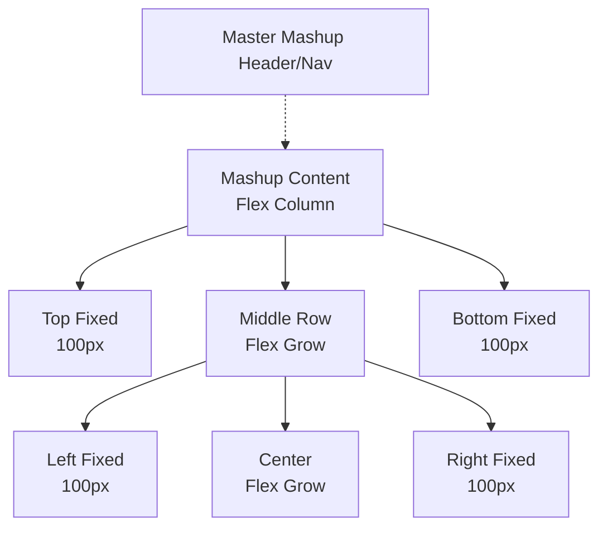

## Recipe 4: Master Mashup & Border Layout

This recipe demonstrates how to use a **Master Mashup** (which provides a consistent Header and Sidebar) and create a **Border Layout** (fixed edges, flexible center) within the content area.

### Purpose
*   **Uniformity**: Uses a shared Master Mashup (`antigravity.Master-mm`) to ensure all pages look part of the same application.
*   **Structured Layout**: Uses a classic "Border Layout" pattern (Top/Bottom/Left/Right fixed panels, Center flexible panel).

### Structure


### Key JSON Properties

#### 1. Configuring the Master
To use a Master Mashup, you simply specify its name in the `Master` property of the Mashup Root.

```javascript
"Properties": {
    "Id": "mashup-root",
    "Type": "mashup",
    // ... standard properties ...
    "Master": "antigravity.Master-mm" // Binds this mashup to the Master
},
```

### Full Creation Script Template

```javascript
/* ... Standard Boilerplate ... */
const MASHUP_NAME = "antigravity.border-layout-mu";

async function createMashup() {
    const mashupContent = {
        "UI": {
            "Properties": {
                "Id": "mashup-root",
                "Type": "mashup",
                "ResponsiveLayout": true,
                "Master": "antigravity.Master-mm", // THE KEY LINE
                // ...
            },
            "Widgets": [
                 {
                    "Properties": {
                        "Type": "flexcontainer",
                        "Id": "flexcontainer-root",
                        "flex-direction": "column",
                        // ...
                    },
                    "Widgets": [
                        // See "Complex Fixed Sidebar Layout" recipe for 
                        // details on how to create fixed Top/Bottom/Left/Right containers
                    ]
                }
            ]
        },
        // ...
    };
    /* ... Send Request ... */
}
```

## Recipe 5: Custom Styled Container (Custom CSS)

This recipe demonstrates how to apply specific CSS (like a custom background color) to a container without creating a full `StyleDefinition` entity.

### Purpose
*   **Ad-hoc Styling**: Quickly applying brand colors (e.g., a specific yellow #F7D154) to a single component.
*   **Overriding Themes**: Forcing a style even if a Theme is active (though `StyleTheme` may sometimes need to be removed).

### Key JSON Properties

#### 1. Mashup Root: CustomCSS
Define your CSS classes in the `CustomCSS` property of the **Mashup Root**.

```javascript
"Properties": {
    "Id": "mashup-root",
    // ...
    // Define the class rule here
    "CustomCSS": ".yellow-bg { background-color: #F7D154; }"
},
```

#### 2. Widget: CustomClass
Apply the class name to the specific **Widget** (e.g., a FlexContainer).

```javascript
{
    "Properties": {
        "Type": "flexcontainer",
        "Id": "flexcontainer-1",
        // ...
        // Apply the class name here (no dot)
        "CustomClass": "yellow-bg"
    },
    "Widgets": []
}
```

### Troubleshooting
If the style does not appear:
1.  **Check Specificity**: Your CSS might be overridden by the system default CSS. Try adding `!important` as a last resort: `background-color: #F7D154 !important;`.
2.  **StyleTheme**: In some versions, the defined `StyleTheme` on the Root might conflict. You can try setting `"StyleTheme": ""` or removing the property if issues persist.
